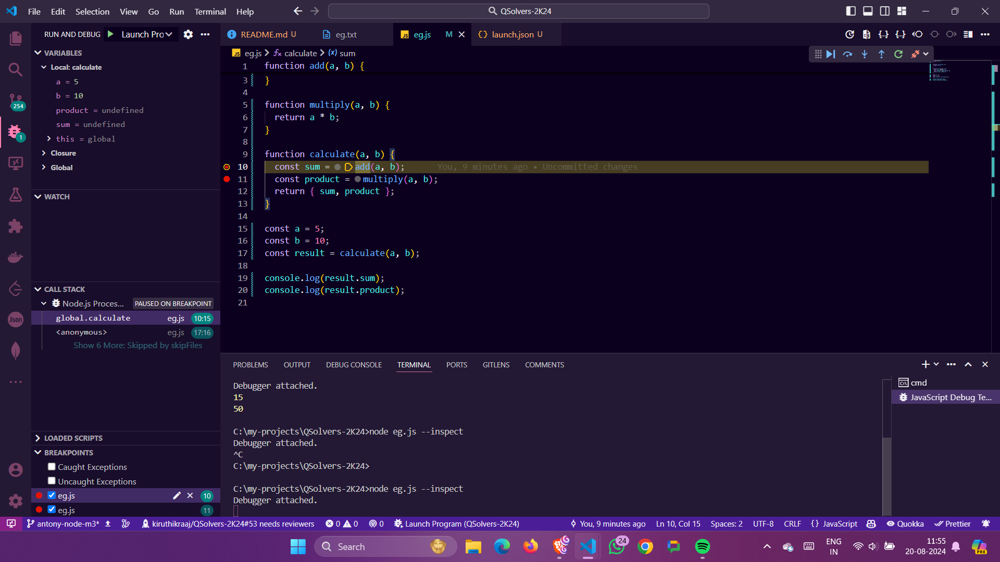

## Milestone - 4

### Table of contents

- [Package.json](#packagejson)
- [Package-lock.json](#package-lockjson)
- [How pnp install works?](#how-pnp-install-works)
- [Dependencies vs DevDependencies](#dependencies-vs-devdependencies)
- [Debugger mode in VS Code](#debugger-mode-in-vs-code)
- [Debugging in the terminal](#debugging-in-the-terminal)
- [Postman Collection](#postman-collection)
  - [How to create a Postman Collection?](#how-to-create-a-postman-collection)
  - [How to add requests to a Postman Collection?](#how-to-add-requests-to-a-postman-collection)
  - [How to run a Postman Collection?](#how-to-run-a-postman-collection)
  - [How to share a Postman Collection?](#how-to-share-a-postman-collection)
- [X-powered-by header](#x-powered-by-header)
- [MongoDB](#mongodb)
  - [Indexing in MongoDB](#indexing-in-mongodb)
  - [Mongoose](#mongoose)
  - [Triggers in MongoDB](#triggers-in-mongodb)
  - [Hooks in MongoDB using Mongoose](#hooks-in-mongodb-using-mongoose)
- [Clustered Index vs Non-Clustered Index](#clustered-index-vs-non-clustered-index)
- [MySQL](#mysql)
  - [Indexing in MySQL](#indexing-in-mysql)
  - [Triggers in MySQL](#triggers-in-mysql)
  - [All Triggers](#all-triggers)
- [SQL Injection](#sql-injection)
  - [Injecting query](#injecting-query)

### package.json

- Package.json file is a JSON file that contains meta-data about the project and its dependencies.
- It is mainly used to give information to pnpmthat allows it to identify the project as well as handle the project's dependencies. It can also contain other metadata such as a project description, version, license, and configuration data.

### package-lock.json

- package-lock.json is automatically generated for any operations where pnp modifies either the node_modules tree, or package.json.
- It describes the exact tree that was generated, such that subsequent installs are able to generate identical trees, regardless of
  intermediate dependency updates.

### How pnp install works?

- When you run `pnpm install`, pnpmlooks at the dependencies listed in the `package.json` file and installs them in the `node_modules` folder.

- If the `node_modules` folder is not present, pnp will create it and install the dependencies.

- If the `node_modules` folder is present, pnpmwill check if the dependencies listed in the `package.json` file are already installed. If they are not installed, pnp will install them.

- If the dependencies are already installed, pnp will check if there are any updates available for the dependencies. If there are updates available, pnpmwill update the dependencies.

- If the `package-lock.json` file is present, pnp will use it to install the exact versions of the dependencies listed in the file.

### Dependencies vs DevDependencies

- Dependencies are the packages that are required for the application to run in production. These packages are installed using the `pnpm install` command.

- DevDependencies are the packages that are only required during development. These packages are not required for the application to run in production. These packages are installed using the `pnpm install --save-dev` command.

> [!TIP]
> When you run `pnpm install`, both dependencies and devDependencies are installed. If you want to install only the dependencies,
> you can use the `pnpm install --only=prod` command. If you want to install only the devDependencies, you can use the `pnpm install --only=dev` command.

### Debugger mode in VS Code

- Debugger mode in VS Code allows you to debug your application by setting breakpoints in your code and stepping through the code line by line.

- To start the debugger mode in VS Code, click on the `Run and Debug` icon in the sidebar and select the `Node.js` environment.

- You can set breakpoints in your code by clicking on the line number in the editor. When you run your application in debugger mode, the debugger will stop at the breakpoints, and you can inspect the variables and step through the code.

```javascript
function add(a, b) {
  return a + b;
}

function multiply(a, b) {
  return a * b;
}

function calculate(a, b) {
  const sum = add(a, b);
  const product = multiply(a, b);
  return { sum, product };
}

const a = 5;
const b = 10;
const result = calculate(a, b);

console.log(result.sum);
console.log(result.product);
```

### Debugging in the terminal

- You can also debug your application in the terminal using the `--inspect` flag.

- To start the debugger in the terminal, run the following command:

```bash
node eg.js --inspect
```



### Postman Collection

- Postman is a collaboration platform for API development that allows you to design, mock, document, and test APIs.

- Postman collections are a group of saved requests that you can organize into folders. You can use collections to group related requests together and share them with your team.

### How to create a Postman Collection?

- To create a Postman collection, follow these steps:

1. Open Postman and click on the `New` button in the top left corner.

2. Click on the `Collection` tab and enter a name for your collection.

3. Click on the `Create` button to create the collection.

4. Click on the `New` button in the top left corner to create a new request.

5. Enter a name for the request and click on the `Save` button.

### How to add requests to a Postman Collection?

- To add requests to a Postman collection, follow these steps:

1. Open the request that you want to add to the collection.

2. Click on the `Save` button in the top right corner.

3. Select the collection that you want to add the request to.

4. Click on the `Save to collection` button to add the request to the collection.

### How to run a Postman Collection?

- To run a Postman collection, follow these steps:

1. Select the collection that you want to run.

2. Click on the `Run` button in the top right corner.

3. Select the Requests that you want to run.

4. Modify the collection run settings if needed.

### How to share a Postman Collection?

- To share a Postman collection, follow these steps:

1. Click on the `Share` button in the top right corner.

2. Select the sharing options that you want to use.

3. Collection can be shared through email or as a link.

### X-powered-by header

- The `X-Powered-By` header is a server response header that indicates the technology used to build the web application.

- This header is often used by attackers to identify the technology stack of a web application and exploit known vulnerabilities.

```javascript
const express = require("express");

const app = express();

app.disable("x-powered-by");
```

> [!DANGER]
>
> It is recommended to disable the `X-Powered-By` header in production to prevent attackers from identifying the technology stack of your web application.
> Helmet removes the `X-Powered-By` header by default.

### MongoDB

- MongoDB is a NoSQL database that stores data in flexible, JSON-like documents.

- It stores data BSON format, which is a binary representation of JSON documents.

### Indexing in MongoDB

- Indexing in MongoDB is the process of creating an index on a field in a collection to improve the read performance at the cost of write performance.

- Indexes are used to quickly locate data without having to search every document in a collection.

- To create an index in MongoDB, you can use the `createIndex` method on the collection object.

```javascript
db.collection.createIndex({ field: 1 });
```

### Mongoose

- Mongoose is an Object Data Modeling (ODM) library for MongoDB and Node.js.

- It provides a schema-based solution to model your application data.

```javascript
const mongoose = require("mongoose");

const userSchema = new mongoose.Schema({
  name: String,
  email: String,
});

userSchema.index({ email: 1 });
```

### Triggers in MongoDB

- Triggers in MongoDB are a way to automatically execute code in response to events that occur in the database.

- Triggers can be used to perform actions such as logging changes to a collection, updating related collections, or sending notifications.

> [!NOTE]
>
> Triggers can be added from the mongoDB Atlas console.
>
> 1. Go to the `Triggers` tab in the Atlas console under `Services`.
> 2. Click on the `Add Trigger` button.
> 3. Select the database and collection for which you want to create the trigger.
> 4. Write the trigger code in the editor.
> 5. Click on the `Save` button to save the trigger.

### Hooks in MongoDB using Mongoose

- Hooks in MongoDB are functions that are executed before or after certain operations are performed on a collection.

- Hooks can be used to perform actions such as validating data before it is inserted into the collection, updating related collections, or sending notifications.

```javascript
const userSchema = new mongoose.Schema({
  name: String,
  email: String,
});

userSchema.pre("save", (next) => {
  console.log("Saving user...");
  next();
});

userSchema.post("save", (doc) => {
  console.log("User saved:", doc);
});
```

### Clustered Index vs Non-Clustered Index

- In clustured index, the data is stored in the same order as the index. In non-clustered index, the data is stored separately from the index.

- A table can have only one clustered index, but multiple non-clustered indexes.

- Clustered indexes do not require additional storage space, but non-clustered indexes do.

### MySQL

- MySQL is an open-source relational database management system that uses SQL to manage and query data.

- It is widely used in web applications to store and retrieve data.

### Indexing in MySQL

- Indexing in MySQL is the process of creating an index on a column in a table to improve the read performance of queries.

- Indexes are used to quickly locate data without having to search every row in a table.

```sql
CREATE INDEX antony ON AntonyJudeShaman (name);
```

> [!NOTE]
>
> The `primary key` column is automatically indexed in MySQL which is unique and not null and acts as clustered index.

### Triggers in MySQL

- Triggers in MySQL are stored programs that are automatically executed in response to certain events on a table.

- Triggers can be used to perform actions such as logging changes to a table, updating related tables, or sending notifications.

#### All Triggers

1. `BEFORE INSERT` - Triggered before inserting a new row into the table.
2. `AFTER INSERT` - Triggered after inserting a new row into the table.
3. `BEFORE UPDATE` - Triggered before updating an existing row in the table.
4. `AFTER UPDATE` - Triggered after updating an existing row in the table.
5. `BEFORE DELETE` - Triggered before deleting an existing row from the table.
6. `AFTER DELETE` - Triggered after deleting an existing row from the table.

```sql
CREATE TRIGGER before_insert
BEFORE INSERT ON AntonyJudeShaman
FOR EACH ROW
BEGIN
  INSERT INTO log_table (message) VALUES ('Inserting new record');
END;

CREATE TRIGGER after_insert
AFTER INSERT ON AntonyJudeShaman
FOR EACH ROW
BEGIN
  INSERT INTO log_table (message) VALUES ('New record inserted');
END;
```

> [!IMPORTANT]
>
> Triggers are basically hooks that are executed before or after certain operations are performed on a table.
> So, triggers are used as hooks in MySQL.

### SQL Injection

- SQL Injection is a type of attack that allows an attacker to execute malicious SQL statements in a web application's database.

- It occurs when a web application does not properly validate user input before passing it to the database.

- To prevent SQL Injection, you can use parameterized queries or prepared statements to sanitize user input before executing SQL queries.

### Injecting query

1. `' OR '1'='1`

   ```sql
   SELECT * FROM users WHERE username = '' OR '1'='1' AND password = 'password';
   ```

2. `'--`

   ```sql
   SELECT * FROM users WHERE username = 'admin' --' AND password = 'password';
   ```

```javascript
const query = "SELECT * FROM users WHERE username = ? AND password = ?";

db.query(query, [username, password], (err, result) => {
  if (err) {
    console.error(err);
  } else {
    console.log(result);
  }
});
```

> [!IMPORTANT]
>
> The inserted values are treated only as a string and not as a SQL query. So, it prevents SQL Injection.
>
> For example, if the user enters `' OR '1'='1` as the username, it will be treated as a string and not as a SQL query.
