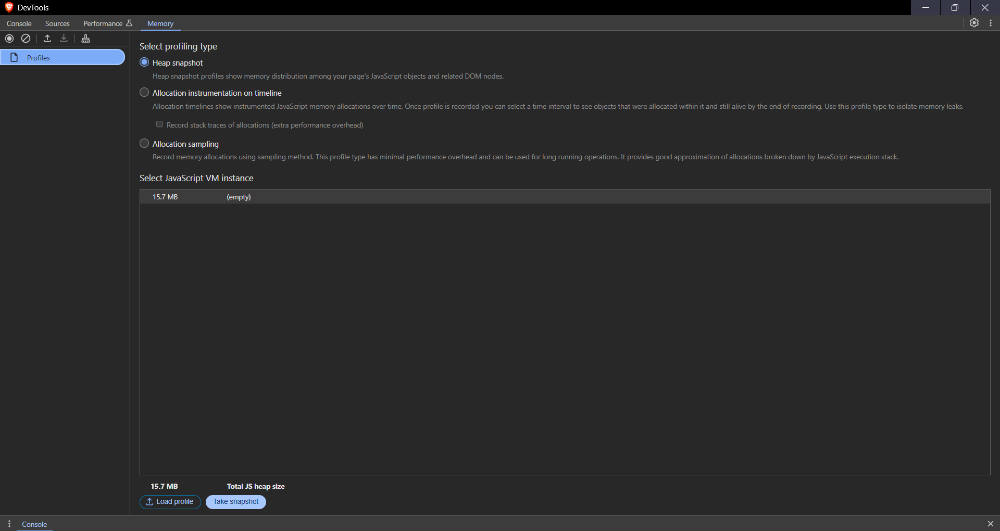

## Milestone - 6

### Table of Contents

- [Memory Leaks in Node.js](#memory-leaks-in-nodejs)
- [Causes of Memory Leaks](#causes-of-memory-leaks)
- [Detecting Memory Leaks](#detecting-memory-leaks)
- [Preventing Memory Leaks](#preventing-memory-leaks)
- [Garbage Collection in Node.js](#garbage-collection-in-nodejs)
- [Old Space and New Space](#old-space-and-new-space)
- [Mark and Sweep Algorithm](#mark-and-sweep-algorithm)
- [GC Pause](#gc-pause)
- [Incremental Garbage Collection](#incremental-garbage-collection)
- [Threads in JavaScript](#threads-in-javascript)
- [Web Workers](#web-workers)
- [Creating a Web Worker](#creating-a-web-worker)
- [Sending messages to a Web Worker](#sending-messages-to-a-web-worker)
- [Receiving messages from a Web Worker](#receiving-messages-from-a-web-worker)
- [Worker Threads](#worker-threads)
- [Service Workers](#service-workers)
- [Service Worker Lifecycle](#service-worker-lifecycle)
- [Registering a Service Worker](#registering-a-service-worker)
- [Installing a Service Worker](#installing-a-service-worker)
- [Clusters in Node.js](#clusters-in-nodejs)
- [Creating a Cluster](#creating-a-cluster)
- [Clusters vs Worker Threads](#clusters-vs-worker-threads)
- [Streams in Node.js](#streams-in-nodejs)
- [Types of Streams](#types-of-streams)
- [Reading from a Readable Stream](#reading-from-a-readable-stream)
- [Writing to a Writable Stream](#writing-to-a-writable-stream)
- [Piping Streams](#piping-streams)
- [Duplex Streams](#duplex-streams)
- [Transform Streams](#transform-streams)
- [Buffers in Node.js](#buffers-in-nodejs)

### Memory Leaks in Node.js

- Memory leaks in Node.js are caused by the accumulation of unused memory in the heap. Memory leaks can cause a Node.js application to consume more memory than necessary, which can lead to performance issues and crashes.

### Causes of Memory Leaks

1. Global Variables: Global variables can cause memory leaks if they are not properly managed.

2. Event Listeners: Event listeners can cause memory leaks if they are not properly removed.

3. Closures: Closures can cause memory leaks if they hold references to objects that are no longer needed.

4. Circular References: Circular references can cause memory leaks if they create a reference cycle that prevents objects from being garbage collected.

### Detecting Memory Leaks

- To detect memory leaks in a Node.js application, you can use the `--inspect` flag to start the application in debug mode and use the Chrome DevTools to analyze the memory usage.

```javascript
const express = require("express");
const app = express();

let arr = [];

app.get("/", (req, res) => {
  res.status(200).send("Hello");
});

app.listen(3000, () => {
  console.log(`Server running`);
});

function fn() {
  let i = 0;
  while (i < 10000) {
    let temp = new Array(100).fill("hello");
    arr.push(temp);
    console.log(arr);
    i++;
  }
}
fn();
```



### Preventing Memory Leaks

1. Remove Event Listeners: Remove event listeners when they are no longer needed.

2. Avoid Global Variables: Avoid using global variables to prevent memory leaks.

3. Use WeakMap: Use WeakMap to store weak references to objects to prevent memory leaks.

4. Manage Cache Carefully: If implementing caching mechanisms, ensure there's a way to clear old or unused cache entries.

5. Declare null: Set variables to null when they are no longer needed. Especially when they are holding large objects.

### Garbage Collection in Node.js

- Garbage collection in Node.js is the process of automatically reclaiming memory that is no longer in use. Garbage collection is used to prevent memory leaks and improve the performance of a Node.js application.

### Old Space and New Space

- In Node.js, memory is divided into two spaces:

1. New Space: New Space is used to store objects when they are first created. Garbage collection is performed more frequently in New Space to reclaim memory that is no longer in use.

2. Old Space: Old Space is used to store objects that have survived multiple garbage collection cycles. Garbage collection is performed less frequently in Old Space to prevent performance issues.

### Mark and Sweep Algorithm

- The Mark and Sweep algorithm is used by the V8 engine to perform garbage collection in Node.js. The Mark and Sweep algorithm consists of the following steps:

1. Mark: The Mark phase is used to mark objects that are reachable from the root objects.

2. Sweep: The Sweep phase is used to sweep objects that are not marked and reclaim memory that is no longer in use.

### GC Pause

- GC Pause is the time taken by the garbage collector to perform garbage collection. GC Pause can cause performance issues in a Node.js application if it takes too long to complete.

- Nodejs uses a collection of techniques to reduce the GC pause time. One of the techniques is to use the `incremental garbage collection` technique.

### Incremental Garbage Collection

- Incremental garbage collection is a technique used to reduce the GC pause time by performing garbage collection in small increments. Incremental garbage collection is used to prevent performance issues in a Node.js application.

### Threads in JavaScript

### What is a thread?

- A thread is a sequence of instructions that can be executed independently of other code. Threads are used to execute multiple tasks simultaneously.
- In JavaScript, threads are used to execute multiple tasks simultaneously. JavaScript is a single-threaded language, which means that it can only execute one task at a time.

### What is a thread pool?

- A thread pool is a collection of threads that are used to execute multiple tasks simultaneously. Thread pools are used to improve the performance of an application by reusing threads instead of creating new threads for each task.

### What is a worker thread?

- A worker thread is a thread that is used to execute a task in the background. Worker threads are used to perform tasks that are time-consuming or that require a lot of processing power.

### Web Workers

- Web Workers are a type of worker thread that can be used to execute JavaScript code in the background. Web Workers are used to perform tasks that are time-consuming or that require a lot of processing power.

### Creating a Web Worker

- To create a Web Worker, you need to create a new Worker object and pass the URL of the JavaScript file that contains the code you want to execute in the background.

```javascript
const worker = new Worker("worker.js");
```

### Sending messages to a Web Worker

- You can send messages to a Web Worker using the postMessage method.

```javascript
// Main thread

const worker = new Worker("worker.js");

worker.postMessage("Hello from the main thread!");

// Worker thread

self.addEventListener("message", (e) => {
  console.log(e.data);
});
```

### Receiving messages from a Web Worker

- You can receive messages from a Web Worker using the onmessage event listener.

```javascript
// Main thread

const worker = new Worker("worker.js");

worker.onmessage = (e) => {
  console.log(e.data);
};

// Worker thread

self.postMessage("Hello from the worker thread!");
```

### Worker Threads

`server.js`

```javascript
const { Worker } = require("worker_threads");

function server() {
  return new Promise((resolve, reject) => {
    const worker = new Worker("./worker.js", {
      workerData: { name: "Antony" },
    });
    worker.on("message", resolve);
    worker.on("error", reject);
    worker.on("exit", (code) => {
      if (code !== 0) {
        reject(new Error(`Worker stopped with exit code ${code}`));
      }
    });
  });
}

server()
  .then((result) => console.log(`I am worker ${process.pid}: ${result}`)) // I am worker 7076: Hello Antony
  .catch((err) => console.error(err));
```

`worker.js`

```javascript
const { workerData, parentPort } = require("worker_threads");

const result = "Hello " + workerData.name;

parentPort.postMessage(result);
```

### Service Workers

- Service Workers are a type of worker thread that can be used to intercept and handle network requests in the background. Service Workers are used to create offline web applications and improve the performance of web applications.

### Service Worker Lifecycle

- Service Workers have a lifecycle that consists of the following states:

1. Registration: The Service Worker is registered in the web application.
2. Installation: The Service Worker is installed in the web application.
3. Activation: The Service Worker is activated in the web application.
4. Idle: The Service Worker is idle and waiting for events.
5. Terminated: The Service Worker is terminated and no longer active.

### Registering a Service Worker

- To create a Service Worker, you need to register the Service Worker in your web application.

```javascript
window.addEventListener("load", () => {
  if ("serviceWorker" in navigator) {
    navigator.serviceWorker
      .register("/sw.js", {
        scope: "/projects",
      })
      .then((registration) => {
        console.log("SW registered", registration.scope);
      })
      .catch((error) => {
        console.error("SW registration failed:", error);
      });
  }
});
```

> [!IMPORTANT]
>
> _The service worker is not immediately activated. It is activated only when the following occurs:_
>
> 1. If there is no other active service worker controlling the page.
> 2. If the user refreshes the page.
> 3. If the `self.skipWaiting()` method is called in the `install` event listener.

### Installing a Service Worker

- To install a Service Worker, you need to create a new Service Worker file and add the following code to the file.

```javascript
const assets = ["/eg.js", "/server.js"];

self.addEventListener("install", (e) => {
  self.skipWaiting();

  e.waitUntil(
    caches.open("myCache").then((cache) => {
      return cache.addAll(assets);
    })
  );
});
```

> [!NOTE]
>
> Once the service worker has been activated, it now has full control of the pages. With the service worker active, it can now handle events such as fetch, push and sync.
>
> ```javascript
> self.addEventListener("fetch", (e) => {
>   e.respondWith(caches.match(e.request)).then((response) => {
>     return response || fetch(e.request);
>   });
> });
> ```

- If the service worker after being active, does not receive any of the functional events mentioned above, it goes into an idle state. After being idle for some time, the service worker goes into a terminated state.

### Clusters in Node.js

- Clusters in Node.js are used to create multiple instances of a Node.js application that can run on multiple CPU cores. Clusters are used to improve the performance of a Node.js application by distributing the workload across multiple CPU cores.

### Creating a Cluster

- To create a cluster in Node.js, you need to use the cluster module.

```javascript
const cluster = require("cluster");
const http = require("http");
const os = require("os");

if (cluster.isMaster) {
  console.log(`Master ${process.pid} is running`);

  for (let i = 0; i < os.cpus().length; i++) {
    cluster.fork();
  }
} else {
  http
    .createServer((req, res) => {
      res.end("Hello from worker " + process.pid);
    })
    .listen(3000);

  console.log(`Worker ${process.pid} started`);
}
```

> [!NOTE]
>
> The number of instances of the application created by the cluster is equal to the number of CPU cores available on the system.

### Clusters vs Worker Threads

1. Clusters are multi-process, while worker threads are multi-threaded.

2. Clusters do not share memory, while worker threads share memory.

3. Clusters can be used when I/O operations are involved, while worker threads can be used when CPU-bound operations are involved.

4. If a cluster worker crashes, it does not affect the other workers, while if a worker thread crashes, it affects the main thread.

5. Clusters are used to create multiple instances of a Node.js runtime, while worker threads are used to execute tasks in the background.

> [!TIP]
>
> - More threads can be created using the worker-thread inside a process, created using the cluster module.

### Streams in Node.js

- Streams in Node.js are used to read and write data in chunks. Streams are used to improve the performance of a Node.js application by reading and writing data in chunks instead of reading and writing data all at once.

- They basically do not wait for the entire data to be loaded into memory, instead they read and write data in chunks.

### Types of Streams

1. Readable Streams: Readable streams are used to read data from a source.

2. Writable Streams: Writable streams are used to write data to a destination.

3. Duplex Streams: Duplex streams are used to read and write data.

4. Transform Streams: Transform streams are used to modify data as it is being read or written.

### Reading from a Readable Stream

- To read data from a readable stream, you need to use the `data` event listener.

```javascript
const fs = require("fs");

const readableStream = fs.createReadStream("file.txt");

readableStream.on("data", (chunk) => {
  console.log(chunk.toString());
});

readableStream.on("end", () => {
  console.log("End of file");
});
```

### Writing to a Writable Stream

- To write data to a writable stream, you need to use the `write` method.

```javascript
const fs = require("fs");

const writableStream = fs.createWriteStream("file.txt");

writableStream.write("Hello World!");

writableStream.end();
```

### Piping Streams

- Piping streams is a technique used to read data from a readable stream and write it to a writable stream.

```javascript
const fs = require("fs");

const readableStream = fs.createReadStream("file.txt");

const writableStream = fs.createWriteStream("output.txt");

readableStream.pipe(writableStream);
```

### Duplex Streams

- Duplex streams are used to read and write data.

```javascript
const { Duplex } = require("stream");

const duplexStream = new Duplex({
  read() {
    this.push("Hello World!");
    this.push(null);
  },
  write(chunk, encoding, next) {
    console.log(chunk.toString());
    next();
  },
});

duplexStream.pipe(process.stdout);

duplexStream.write("Hello");
```

### Transform Streams

- Transform streams are used to modify data as it is being read or written.

```javascript
const { Transform } = require("stream");

const upperCaseTransform = new Transform({
  transform(chunk, encoding, next) {
    this.push(chunk.toString().toUpperCase());
    next();
  },
});

process.stdin.pipe(upperCaseTransform).pipe(process.stdout);
```

### Buffers in Node.js

- Buffers in Node.js are used to store binary data. Buffers are used to improve the performance of a Node.js application by storing binary data in memory.

```javascript
const buffer = new Buffer.from("Antony");

buffer.write("Hello Everyone");

console.log(buffer.toString()); // Hello

console.log(buffer.toJSON());

console.log(buffer);
```

> [!NOTE]
>
> - Buffers store the chunks of data as Hexadecimal values which refers to the ASCII values of the characters.
> - They can be converted to JSON format using the `toJSON()` method which returns an object with the `type` and `data` properties.
> - Buffers can be converted to strings using the `toString()` method.
