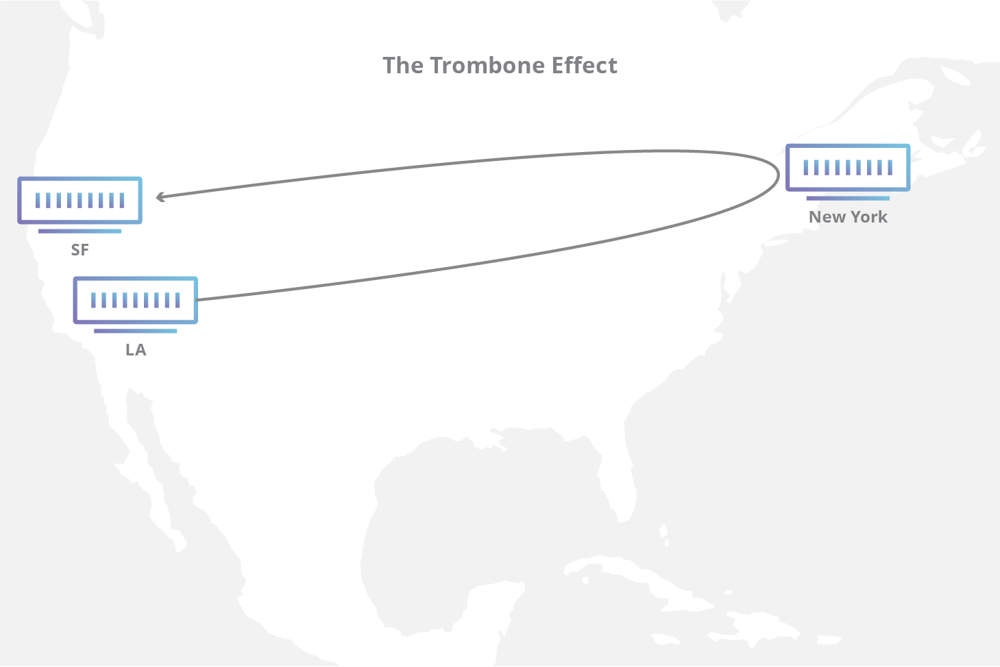
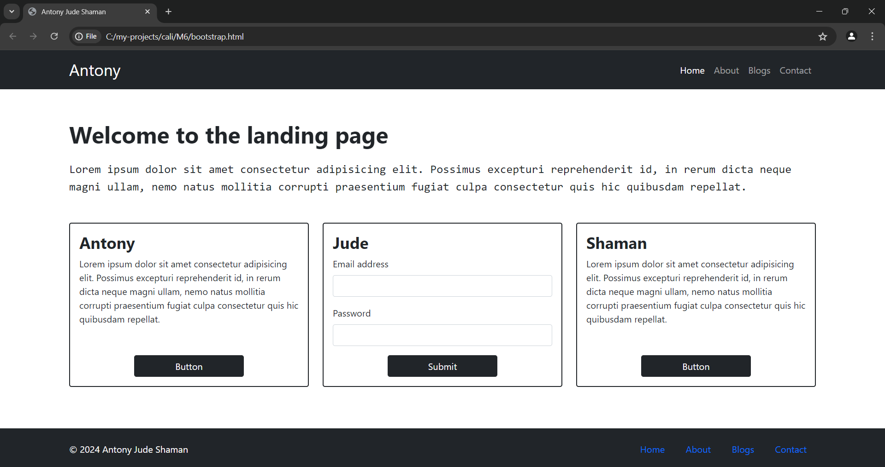
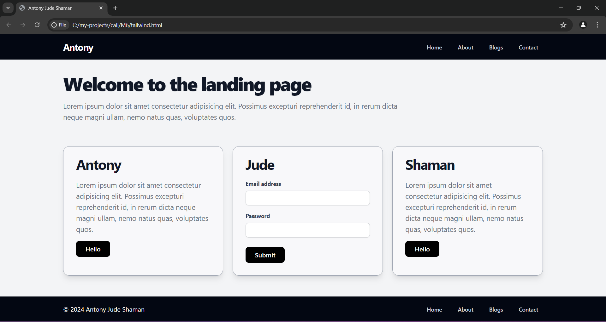

# Milestone 6

# Table of Contents

- [CDN (Content Delivery Network)](#cdn-content-delivery-network)
  1.  [Components of a CDN](#components-of-a-cdn)
      - [Origin Server](#origin-server)
      - [Edge Servers](#edge-servers)
      - [PoPs (Points of Presence)](#pops-points-of-presence)
  2.  [Benefits of Using a CDN](#benefits-of-using-a-cdn)
      - [Faster Load Times](#faster-load-times)
      - [Scalability](#scalability)
      - [Reliability](#reliability)
  3.  [DDOS Protection](#ddos-protection)
      - [Stages in Mitigating DDoS Attacks](#stages-in-mitigating-ddos-attacks)
        - [Detection](#detection)
        - [Response](#response)
        - [Routing](#routing)
        - [Adaptation](#adaptation)
  4.  [CDN as a Reverse Proxy](#cdn-as-a-reverse-proxy)
      - [Internet Exchange Points (IXPs)](#internet-exchange-points-ixps)
        - [Trombone Effect](#trombone-effect)
  5.  [Border Gateway Protocol (BGP)](#border-gateway-protocol)
      - [Autonomous Systems](#autonomous-systems)
      - [BGP and TCP](#bgp-and-tcp)
        - [SYN](#syn)
        - [SYN + ACK](#syn--ack)
        - [ACK](#ack)
- [Bootstrap](#a-simple-landing-page-using-bootstrap)
- [Tailwind CSS](#a-simple-landing-page-using-tailwind-css)

## CDN (Content Delivery Network)

- A Content Delivery Network (CDN) is a network of servers distributed across the globe to deliver content to users quickly. CDNs are used to cache static assets like images, CSS, and JavaScript files.

- The primary goal of a CDN is to reduce latency and improve website performance.

### Components of a CDN

1. **Origin Server** - The server where the original content is stored.

2. **Edge Servers** - Servers located in different geographical locations to cache content and deliver it to users quickly.

3. **PoPs (Points of Presence)** - Data centers where edge servers are located.

### Benefits of Using a CDN

1. **Faster Load Times** - Content is delivered from the nearest edge server, reducing latency.

2. **Scalability** - CDNs can handle high traffic loads and distribute content efficiently.

3. **Reliability** - CDNs provide redundancy and failover mechanisms to ensure content availability.

#### DDOS Protection

- A distributed Denial of Service attack is an attempt to overwhelm a website or server with traffic from multiple sources. CDNs can help mitigate DDoS attacks by distributing traffic across multiple servers.

#### 4 Stages in mitigating DDoS attacks

1. **Detection** - Identifying abnormal traffic patterns and distinguishing between legitimate and malicious traffic.

2. **Response** - Implementing countermeasures to mitigate the attack and protect the network.

3. **Routing** - Redirecting traffic through scrubbing centers to filter out malicious traffic.

4. **Adaptation** - Adjusting security measures based on the evolving nature of DDoS attacks.

### CDN as a Reverse Proxy

- A reverse proxy is a server that sits between clients and the origin server, forwarding client requests to the origin server and caching responses to improve performance.

- CDNs act as reverse proxies by caching content at edge servers and delivering it to users, reducing the load on the origin server and improving response times.

- CDNs also route traffic to the nearest edge server based on the user's location, further reducing latency.

#### Internet exchange points (IXPs)

- Internet exchange points are physical locations where different Internet service providers (ISPs) connect and exchange traffic. IXPs facilitate the exchange of data between networks and improve network performance.

- **Trombone Effect**: The trombone effect occurs when traffic is routed inefficiently, causing data packets to travel long distances before reaching their destination. CDNs help reduce the trombone effect by routing traffic through the nearest edge server.
  

### Border Gateway Protocol

- BGP is the postal service of the internet, it efficiently routes traffic over the network through Autonomous Systems (AS).

### Autonomous Systems

- These are like local post offices that handle traffic within a specific region or network. It helps BGP route traffic efficiently.

#### BGP and TCP

- BGP uses the Transmission Control Protocol (TCP) to establish connections between routers and exchange routing information. TCP ensures reliable data transmission and error detection.

- TCPs three-way handshake is used to establish a connection between routers before exchanging BGP routing updates.

1. **SYN** - Client sending Synchronize Sequence Number to inititate the communication.

2. **SYN + ACK** - The server responds with it SYN and an acknowledgement of the request to initiate the connection.

3. **ACK** - Client acknowledges the response received from the server and they both establish a connection.

## Bootstrap

- Bootstrap is a popular front-end framework for building responsive and mobile-first websites. It provides components that can be easily integrated into web projects.

- Bootstrap includes components like grids, buttons, forms, and navigation bars that help developers create modern and visually appealing websites.

### A simple landing page using Bootstrap

```html
<!DOCTYPE html>
<html lang="en">
  <head>
    <meta charset="UTF-8" />
    <meta http-equiv="X-UA-Compatible" content="IE=edge" />
    <meta name="viewport" content="width=device-width, initial-scale=1.0" />
    <title>Antony Jude Shaman</title>
    <link
      href="https://cdn.jsdelivr.net/npm/bootstrap@5.0.2/dist/css/bootstrap.min.css"
      rel="stylesheet"
      integrity="sha384-EVSTQN3/azprG1Anm3QDgpJLIm9Nao0Yz1ztcQTwFspd3yD65VohhpuuCOmLASjC"
      crossorigin="anonymous"
    />
  </head>
  <script>
    function handleFormSubmit(event) {
      event.preventDefault();
      const email = document.getElementById("email").value;
      const password = document.getElementById("password").value;
      alert(`Email: ${email} Password: ${password}`);
    }
  </script>
  <body>
    <nav class="navbar navbar-expand-lg navbar-dark bg-dark">
      <div class="container">
        <a class="navbar-brand display-12" href="#">Antony</a>
        <button
          class="navbar-toggler"
          type="button"
          data-bs-toggle="collapse"
          data-bs-target="#navbarNav"
          aria-controls="navbarNav"
          aria-expanded="false"
          aria-label="Toggle navigation"
        >
          <span class="navbar-toggler-icon"></span>
        </button>
        <div class="collapse navbar-collapse" id="navbarNav">
          <ul class="navbar-nav ms-auto">
            <li class="nav-item">
              <a class="nav-link active" href="#">Home</a>
            </li>
            <li class="nav-item">
              <a class="nav-link" href="about">About</a>
            </li>
            <li class="nav-item">
              <a class="nav-link" href="blogs">Blogs</a>
            </li>
            <li class="nav-item">
              <a class="nav-link" href="contact">Contact</a>
            </li>
          </ul>
        </div>
      </div>
    </nav>
    <div class="container mt-5">
      <h1 class="display-24">Welcome to the landing page</h1>
      <p class="lead">
        Lorem ipsum dolor sit amet consectetur adipisicing elit. Possimus
        excepturi reprehenderit id, in rerum dicta neque magni ullam, nemo natus
        mollitia corrupti praesentium fugiat culpa consectetur quis hic
        quibusdam repellat.
      </p>
      <a href="#" class="btn btn-primary">Button</a>
    </div>

    <section class="container mt-5">
      <div class="row">
        <div class="col-md-4">
          <div class="card border-2 border-primary rounded-2">
            <div class="card-body">
              <h5 class="card-title display-12">Antony</h5>
              <p class="card-text">
                Lorem ipsum dolor sit amet consectetur adipisicing elit.
                Possimus excepturi reprehenderit id, in rerum dicta neque magni
                ullam, nemo natus mollitia corrupti praesentium fugiat culpa
                consectetur quis hic quibusdam repellat.
              </p>
              <a href="#" class="btn btn-primary">Button</a>
            </div>
          </div>
        </div>
        <div class="col-md-4">
          <form
            class="card border-2 border-primary rounded-2 card-body"
            onsubmit="handleFormSubmit(event)"
          >
            <div class="mb-3 card-bo">
              <label for="email" class="form-label display-12"
                >Email address</label
              >
              <input type="email" class="form-control" id="email" />
            </div>
            <div class="mb-3">
              <label for="password" class="form-label display-12"
                >Password</label
              >
              <input type="password" class="form-control" id="password" />
            </div>
            <button
              type="submit"
              class="btn btn-primary w-50 position-relative d-block mx-auto"
            >
              Submit
            </button>
          </form>
        </div>
        <div class="col-md-4">
          <div class="card border-2 border-primary rounded-2">
            <div class="card-body">
              <h5 class="card-title display-12">Shaman</h5>
              <p class="card-text">
                Lorem ipsum dolor sit amet consectetur adipisicing elit.
                Possimus excepturi reprehenderit id, in rerum dicta neque magni
                ullam, nemo natus mollitia corrupti praesentium fugiat culpa
                consectetur quis hic quibusdam repellat.
              </p>
              <a href="#" class="btn btn-primary">Button</a>
            </div>
          </div>
        </div>
      </div>
    </section>

    <footer
      class="bg-dark d-inline-flex justify-between col-12 position-absolute mx-auto d-block bottom-0 text-white text-center py-3"
    >
      <div class="container">
        <div class="row align-items-center">
          <div class="col-md-6 text-md-start text-center mb-2 mb-md-0">
            <p class="mb-0">&copy; 2024 Antony Jude Shaman</p>
          </div>
          <div class="col-md-6 text-md-end text-center">
            <a href="#" class="nav-link d-inline-block">Home</a>
            <a href="about" class="nav-link d-inline-block">About</a>
            <a href="blogs" class="nav-link d-inline-block">Blogs</a>
            <a href="contact" class="nav-link d-inline-block">Contact</a>
          </div>
        </div>
      </div>
    </footer>
    <script
      src="https://cdn.jsdelivr.net/npm/bootstrap@5.0.2/dist/js/bootstrap.bundle.min.js"
      integrity="sha384-MrcW6ZMFYlzcLA8Nl+NtUVF0sA7MsXsP1UyJoMp4YLEuNSfAP+JcXn/tWtIaxVXM"
      crossorigin="anonymous"
    ></script>
  </body>
</html>
```



- This includes a navigation bar, a hero section, and three cards with content. The form in the middle card demonstrates form validation using JavaScript.

### A simple landing page using Tailwind CSS

```html
<!DOCTYPE html>
<html lang="en">
  <head>
    <meta charset="UTF-8" />
    <meta name="viewport" content="width=device-width, initial-scale=1.0" />
    <title>Antony Jude Shaman</title>
    <script src="https://cdn.tailwindcss.com"></script>
  </head>
  <script>
    function handleFormSubmit(event) {
      event.preventDefault();
      const email = document.getElementById("email").value;
      const password = document.getElementById("password").value;
      alert(`Email: ${email} Password: ${password}`);
    }
  </script>
  <body class="bg-gray-100">
    <nav class="bg-gray-950">
      <div class="max-w-7xl mx-auto px-4 sm:px-6 lg:px-8">
        <div class="flex items-center justify-between h-16">
          <div class="flex items-center">
            <a href="#" class="text-white text-2xl font-bold tracking-tighter"
              >Antony</a
            >
          </div>
          <div class="ml-10 flex items-baseline space-x-4">
            <a
              href="#"
              class="text-gray-300 hover:bg-gray-700 hover:text-white px-3 py-2 rounded-md text-sm font-medium"
              >Home</a
            >
            <a
              href="about"
              class="text-gray-300 hover:bg-gray-700 hover:text-white px-3 py-2 rounded-md text-sm font-medium"
              >About</a
            >
            <a
              href="blogs"
              class="text-gray-300 hover:bg-gray-700 hover:text-white px-3 py-2 rounded-md text-sm font-medium"
              >Blogs</a
            >
            <a
              href="contact"
              class="text-gray-300 hover:bg-gray-700 hover:text-white px-3 py-2 rounded-md text-sm font-medium"
              >Contact</a
            >
          </div>
        </div>
      </div>
    </nav>

    <div class="max-w-7xl mx-auto py-6 sm:px-6 lg:px-8">
      <div class="py-3">
        <h1 class="text-5xl font-extrabold tracking-tighter text-gray-900">
          Welcome to the landing page
        </h1>
        <p class="mt-5 max-w-4xl text-lg text-gray-500">
          Lorem ipsum dolor sit amet consectetur adipisicing elit. Possimus
          excepturi reprehenderit id, in rerum dicta neque magni ullam, nemo
          natus quas, voluptates quos.
        </p>
      </div>
      <div class="py-12">
        <div class="grid grid-cols-3 space-x-6">
          <section
            class="bg-white/40 shadow-lg rounded border border-gray-400 rounded-2xl px-8 pt-6 pb-8 mb-4"
          >
            <h1 class="text-4xl font-bold tracking-tighter text-gray-900">
              Antony
            </h1>
            <p class="mt-5 max-w-4xl text-lg text-gray-500">
              Lorem ipsum dolor sit amet consectetur adipisicing elit. Possimus
              excepturi reprehenderit id, in rerum dicta neque magni ullam, nemo
              natus quas, voluptates quos.
            </p>
            <button
              class="bg-black text-white font-semibold px-6 py-2 mt-4 rounded-lg hover:bg-gray-950"
            >
              Hello
            </button>
          </section>
          <form
            class="bg-white/40 shadow-lg rounded border border-gray-400 rounded-2xl px-8 pt-6 pb-8 mb-4"
            onsubmit="handleFormSubmit(event)"
          >
            <h1 class="text-4xl font-bold tracking-tighter text-gray-900">
              Jude
            </h1>
            <div class="mb-4 mt-5">
              <label
                for="email"
                class="block text-gray-700 text-sm font-bold mb-2"
                >Email address</label
              >
              <input
                type="email"
                id="email"
                class="shadow-sm border border-gray-800/20 rounded-lg w-full py-2 px-3 text-gray-700 leading-tight focus:outline-black"
              />
            </div>
            <div class="mb-6">
              <label
                for="password"
                class="block text-gray-700 text-sm font-bold mb-2"
                >Password</label
              >
              <input
                type="password"
                id="password"
                class="shadow-sm border border-gray-800/20 rounded-lg w-full py-2 px-3 text-gray-700 leading-tight focus:outline-black"
              />
            </div>
            <button
              type="submit"
              class="bg-black text-white font-semibold px-6 py-2 rounded-lg hover:bg-gray-950"
            >
              Submit
            </button>
          </form>
          <section
            class="bg-white/40 shadow-lg rounded border border-gray-400 rounded-2xl px-8 pt-6 pb-8 mb-4"
          >
            <h1 class="text-4xl font-bold tracking-tighter text-gray-900">
              Shaman
            </h1>
            <p class="mt-5 max-w-4xl text-lg text-gray-500">
              Lorem ipsum dolor sit amet consectetur adipisicing elit. Possimus
              excepturi reprehenderit id, in rerum dicta neque magni ullam, nemo
              natus quas, voluptates quos.
            </p>
            <button
              class="bg-black text-white font-semibold px-6 py-2 mt-4 rounded-lg hover:bg-gray-950"
            >
              Hello
            </button>
          </section>
        </div>
      </div>
    </div>
    <footer class="bg-gray-950 absolute bottom-0 w-full">
      <div class="max-w-7xl mx-auto px-4 sm:px-6 lg:px-8">
        <div class="flex items-center justify-between h-16">
          <div class="flex items-center">
            <p class="text-white">© 2024 Antony Jude Shaman</p>
          </div>
          <div class="flex items-center">
            <div class="ml-10 flex items-baseline space-x-4">
              <a
                href="#"
                class="text-gray-300 hover:bg-gray-700 hover:text-white px-3 py-2 rounded-md text-sm font-medium"
                >Home</a
              >
              <a
                href="about"
                class="text-gray-300 hover:bg-gray-700 hover:text-white px-3 py-2 rounded-md text-sm font-medium"
                >About</a
              >
              <a
                href="blogs"
                class="text-gray-300 hover:bg-gray-700 hover:text-white px-3 py-2 rounded-md text-sm font-medium"
                >Blogs</a
              >
              <a
                href="contact"
                class="text-gray-300 hover:bg-gray-700 hover:text-white px-3 py-2 rounded-md text-sm font-medium"
                >Contact</a
              >
            </div>
          </div>
        </div>
      </div>
    </footer>
  </body>
</html>
```



- This includes a navigation bar, a hero section, and three cards with content. The form in the middle card demonstrates form validation using JavaScript.
