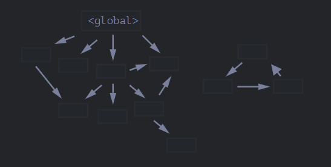
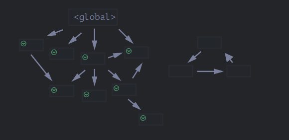
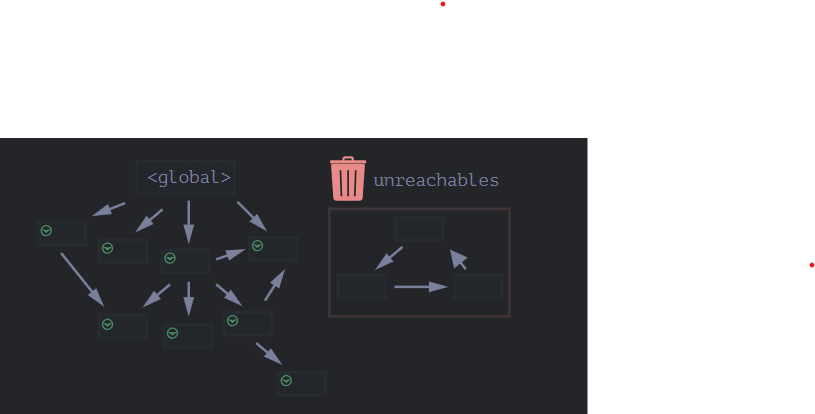

## Milestone - 7

## Table of Contents

- [Memory Management](#memory-management)
  - [Garbage Collection](#garbage-collection)
  - [Memory Allocation](#memory-allocation)
  - [Memory Size](#memory-size)
  - [Memory Management](#memory-management-1)
  - [Reference Counting](#reference-counting)
  - [How it works?](#how-it-works)
  - [Reference Counting Example](#reference-counting-example)
  - [Two Reference](#two-reference)
  - [Circular Reference Problem](#circular-reference-problem)
  - [Mark and Sweep](#mark-and-sweep)

## Garbage Collection

- Garbage collection is the process of automatically reclaiming memory that is no longer in use by the program.
- In JavaScript, garbage collection is done by the JavaScript engine, which automatically frees up memory that is no longer needed by the program.

### Memory Allocation

- Memory is allocated to a program when it is loaded into the memory.
- The memory is allocated in the form of stack and heap. The stack is used for static memory allocation and heap is used for dynamic memory allocation.
- The stack is used for storing local variables and function calls. The heap is used for storing dynamic memory allocation.

> [!NOTE]  
> Primitive data types are stored in the stack. Stacks are faster than heaps but limited in size.
> Non-primitive data types are stored in the heap. Heaps are slower than stacks but have no size limit.

### Memory Size

- The sizes of various data types in Javascript

| Data Type | Size (in bytes)     |
| --------- | ------------------- |
| Number    | Varies by JS Engine |
| String    | Varies by JS Engine |
| Boolean   | Varies by JS Engine |
| Object    | Varies by JS Engine |
| Array     | Varies by JS Engine |
| Function  | Varies by JS Engine |
| Null      | Varies by JS Engine |
| Undefined | Varies by JS Engine |

```javascript
function getSize(obj) {
  console.log(new TextEncoder().encode(JSON.stringify(obj)).length);
  return new TextEncoder().encode(JSON.stringify(obj)).length;
}

const name = "abc";
console.log(getSize(name)); // 5

const num = 123;
console.log(getSize(num)); // 3

const bool = true;
console.log(getSize(bool)); // 4

const obj = { name: "abc" };
console.log(getSize(obj)); // 14

const arr = [1, 2, 3];
console.log(getSize(arr)); // 7

const func = function () {
  return "abc";
};

console.log(getSize(func)); // 0

const n = null;
console.log(getSize(n)); // 4

const u = undefined;
console.log(getSize(u)); // 0
```

### Memory Management

### Reference Counting

- In reference counting, the garbage collector keeps track of the number of references to an object. If an object has zero references, it is considered garbage and is collected by the garbage collector.

### How it works?

    1. When an object is created, the reference count is set to 1.
    2. When an object is referenced by another object, the reference count is incremented by 1.
    3. When an object is dereferenced by another object, the reference count is decremented by 1.
    4. When the reference count reaches 0, the object is considered garbage and is collected by the garbage collector.

> [!IMPORTANT]  
> `Reachability` is the key concept in garbage collection. If an object is reachable from the root, it is considered `reachable` and is not garbage collected.

### Reference Counting Example

```javascript
let person = { name: "Antony" };
// now person has a reference to the object { name: "Antony" }

person = null; // if the person is set to null, the reference is lost

// Now Antony becomes unreachable and is garbage collected
```

### Two Reference

```javascript
let person = { name: "Antony" }; // person only holds a reference to the object not the value

let person2 = person;

// if the person is set to null, even though the reference of person is lost, the object is still referenced by person2
person = null;
// only the reference is being set to null but the object is still in the memory

// so the object still stays in the memory becuase it reachable through the person2
```

### Circular Reference Problem

- In circular reference, two objects that are no longer needed reference each other, creating a cycle. In this case, the reference count of both objects will never reach 0, and they will never be garbage collected.

```javascript
let person = { name: "Antony" };

let person2 = { name: "Jude" };

person.friend = person2;

person2.friend = person;

// even though person and person2 are not reachable from the root, they are still reachable from each other
// so they will not be garbage collected in reference counting
```

### Mark and Sweep

- In mark and sweep, the garbage collector marks all the objects that are reachable from the root and then sweeps through the memory to collect the objects that are not marked.

Let's consider the following example:



- As shown in the diagram, the garbage collector starts from the root and marks all the objects that are reachable from the root.



- All the reachable objects are marked. Now the garbage collector sweeps through the memory and collects the objects that are not marked.



> [!NOTE]  
> As you can see the objects on the right side forms a cycle which would prevent them from being garbage collected using reference counting.
> _This problem is solved by mark and sweep algorithm where cyclic references are not a problem._

### Generational Garbage Collection

- Generational garbage collection is a technique used by V8 JavaScript engine to improve the performance of garbage collection.

- In generational garbage collection, objects are divided into different generations based on their age.

1. **Young Generation:** Newly created objects are placed in the young generation.

- **New Space:** This is where the young generation objects are stored. It is small in size and is garbage collected frequently.

- **Survivor Space:** This is where the objects that survive the garbage collection in the young generation are moved to. It is also small in size and is garbage collected less frequently.

2. **Old Generation:** Objects that have survived multiple garbage collections are moved to the old generation.

- **Old Space:** This is where the old generation objects are stored. It is large in size and is garbage collected less frequently.

### Why Functions in Heap and Function Calls in Stack?

#### Functions in Heap

- The functions need to exist in memory for the entire duration of the program. This is because functions can be called at any time, and they need to be available in memory when they are called. If functions were stored on the stack, they would be removed from memory as soon as they were called, which would make them unavailable for future calls.

- Complex functions can be large in size and take up a lot of memory. Although heaps are slower to access than stacks, they are better suited for storing large amounts of data.

#### Function Calls in Stack

- When a function is called, a new stack frame is created on the stack. The stack frame is removed from the stack when the function returns. This allows functions to be called recursively without running out of memory.

### Memory Life Cycle

- The memory life cycle of a variable in JavaScript consists of three stages

  - Allocation: The variable is allocated memory when it is declared.
  - Use: Use the allocated memory to store the value of the variable.
  - Deallocation: The variable is deallocated when it is not needed anymore.

### Performance

- The performance of a program can be affected by how memory is managed. If memory is not managed efficiently, it can lead to memory leaks, which can slow down the program and cause it to crash.

#### Memory Leaks

- Memory leaks occur when memory is allocated but not deallocated. It means references to objects that are no longer needed are not removed, which prevents the garbage collector from reclaiming the memory.

```javascript
let array = [];
let intervalId;

function createArray() {
  intervalId = setInterval(() => {
    array.push(new Array(100).fill("1")); // The array keeps growing and consumes more memory which leads to memory leak
  }, 1000);
}

function clearArray() {
  clearInterval(intervalId); // Clearing interval to stop the function from running
  array = null; // Setting the array to null to free up memory
}

createArray();

setTimeout(clearArray, 10000); // Clearing the array after 10 seconds
```

### GC Pause

- The garbage collector runs periodically to reclaim memory that is no longer needed. When the garbage collector runs, it pauses the execution of the program, which can cause a delay in the program.

- The duration of the pause depends on the size of the heap and the number of objects that need to be collected. If the heap is large and contains many objects, the garbage collector will take longer to collect the objects, which can lead to a longer pause.

> [!TIP]
>
> Efficient allocation and deallocation of memory reduce the overhead and improves performance.

### Steps for Efficient Memory Management

- Use `const` by default and only use `let` unless you need to reassign a variable.

- Make use of `scopes` to limit the lifetime of variables.

- Remove `event listeners` when they are no longer needed to prevent memory leaks.

- `Object pooling` can be used to reuse objects instead of creating new objects.
