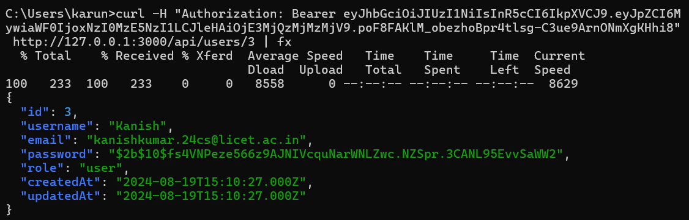

## Milestone - 5

## cURL:

- cURL (Client URL) is a command-line tool used for transferring data to or from a server using various protocols, including HTTP, HTTPS, FTP, and more. 

- It is widely used for making HTTP requests and interacting with APIs.

### Features:

- `Protocol Support:`
    Works with many protocols, including HTTP, HTTPS, FTP, FTPS, SCP, and others.

- `Data Transmission:` 
    Can send data using various HTTP methods like GET, POST, PUT, DELETE, etc.

- `Headers and Cookies:` 
    Supports adding custom headers and handling cookies.

- `File Transfers:` Can download or upload files.

- `Cross-Platform:`
     Available on various operating systems, including Linux, macOS, and Windows.

### Syntax:

        curl [options] [URL]

1. Uses HTTP Method 

        curl -X [METHOD] [URL]

2. Send data
        
        curl -d [METHOD] [URL]

3. Add Headers 

        curl -H [HEADER] [URL]

4. Send Output to file

        curl -o [filename] [URL]

5. Silent Mode

        curl -s [URL]

### 1. Get a webpage from a server using port 3000:

        curl -s "http://127.0.0.1:3000/api/trains" | fx

### 2. POST methd with request body content as JSON type:

        curl -X POST -H "Content-Type: application/json" -d "{\"username\":\"kanish\", \"password\":\"Kanish@123\"}" http://localhost:3000/api/users/login/

### 3. Response as Output file

        curl -o demo.txt http://127.0.0.1:3000/api/trains | fx

### 4. Show Header Information also

        curl -i "http://localhost:3000/"

### 5. To view verbose output:

What Verbose Output Includes

`Request Headers`: Information about the headers being sent to the server.

`Response Headers`: Information about the headers received from the server.

`Request Details:`

Details about the connection and request process, including any redirects.

`Body Data`: The body of the request and response (if applicable).

        curl -v "http://localhost:3000/"

### 6. Adding Header

        curl -H "Authorization: Bearer <token>" http://127.0.0.1:3000/api/users/3 | fx

