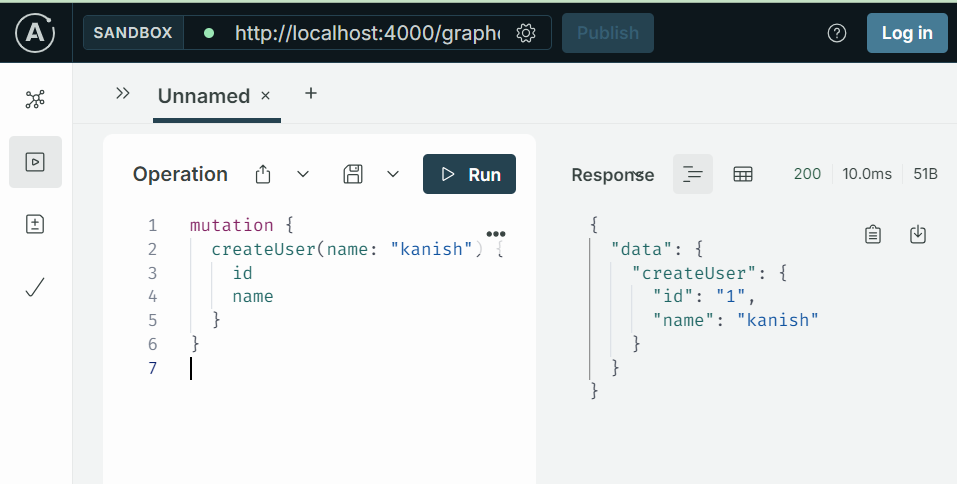
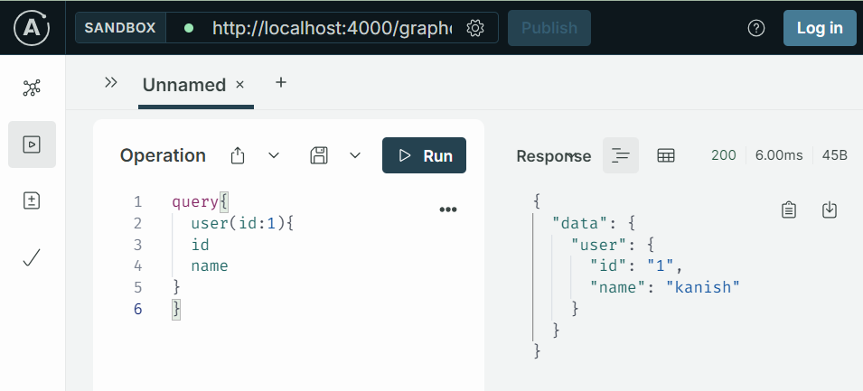
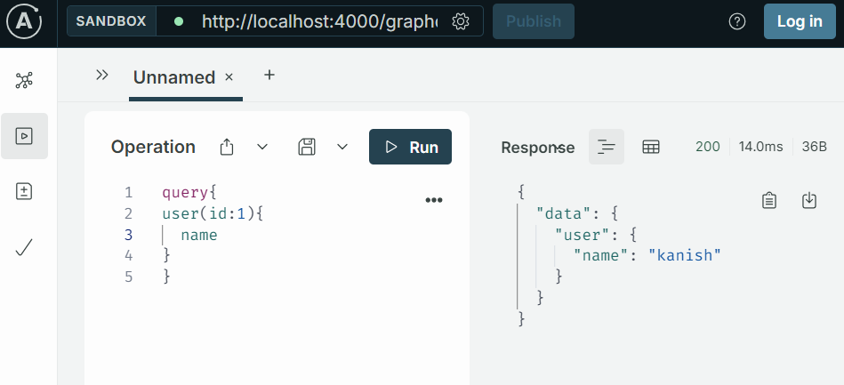
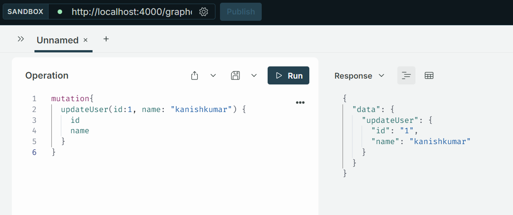
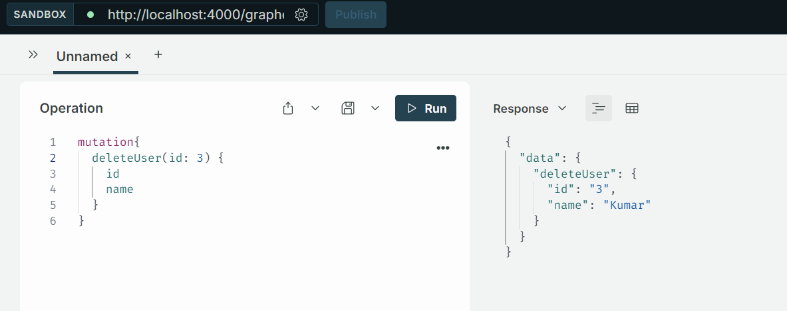
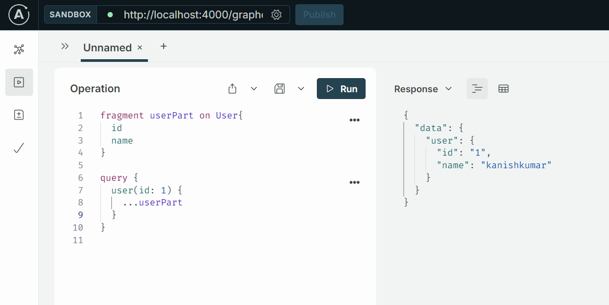
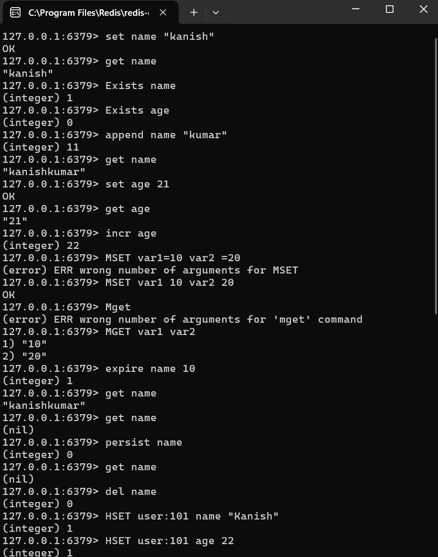
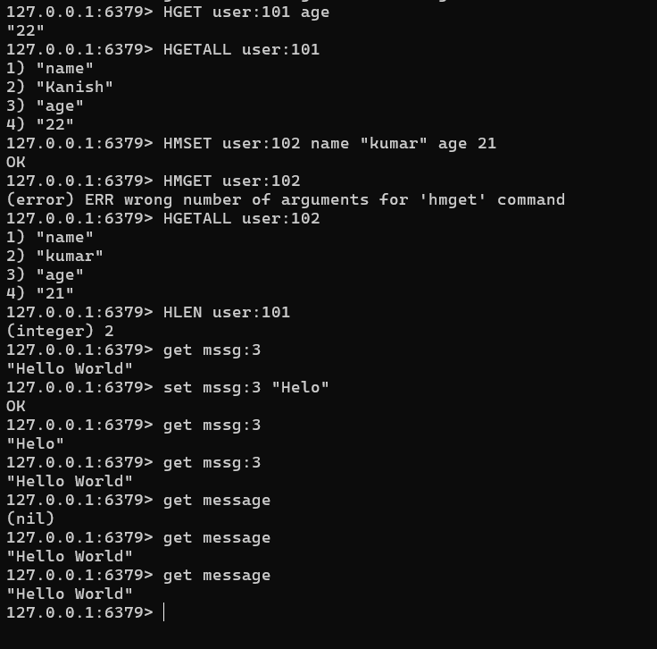
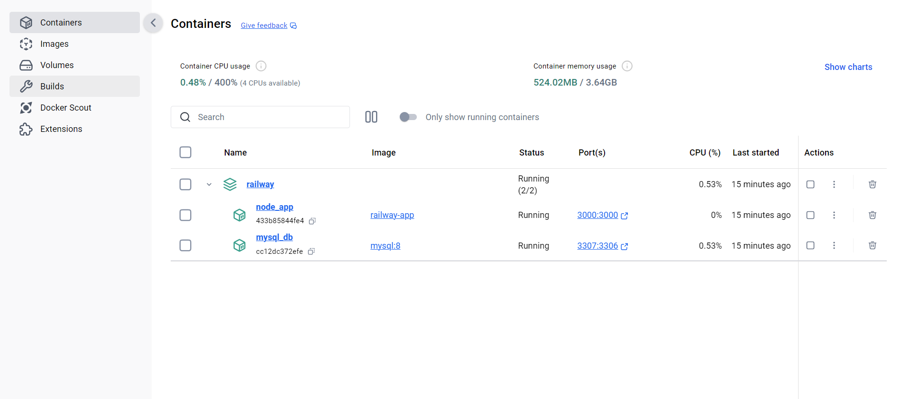
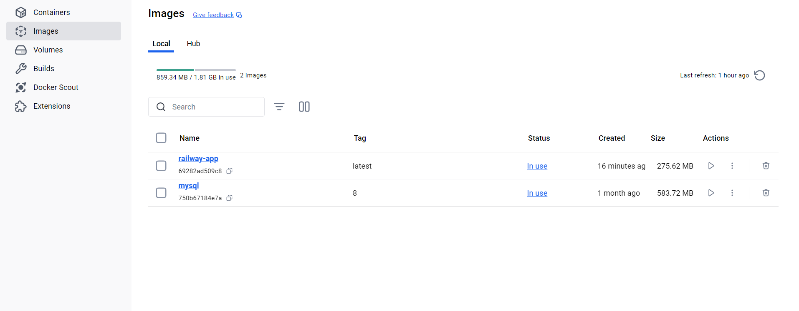

## Milestone - 5

## cURL:

- cURL (Client URL) is a command-line tool used for transferring data to or from a server using various protocols, including HTTP, HTTPS, FTP, and more. 

- It is widely used for making HTTP requests and interacting with APIs.

### Features:

- `Protocol Support:`
    Works with many protocols, including HTTP, HTTPS, FTP, FTPS, SCP, and others.

- `Data Transmission:` 
    Can send data using various HTTP methods like GET, POST, PUT, DELETE, etc.

- `Headers and Cookies:` 
    Supports adding custom headers and handling cookies.

- `File Transfers:` Can download or upload files.

- `Cross-Platform:`
     Available on various operating systems, including Linux, macOS, and Windows.

### Syntax:

        curl [options] [URL]

1. Uses HTTP Method 

        curl -X [METHOD] [URL]

2. Send data

        curl -d [METHOD] [URL]

3. Add Headers 

        curl -H [HEADER] [URL]

4. Send Output to file

Saves the response to a file

        curl -o [filename] [URL]

5. Silent Mode

Supreeses error messages and progress meters

        curl -s [URL]

### Get a webpage from a server using port 3000:

        curl -s "http://127.0.0.1:3000/api/trains" | fx

### GET with Query Parameters:

        curl "http://example.com?param1=value1&param2=value2"

### POST methd with request body content as JSON type:

        curl -X POST -H "Content-Type: application/json" -d "{\"username\":\"kanish\", \"password\":\"Kanish@123\"}" http://localhost:3000/api/users/login/

### Response as Output file

        curl -o demo.txt http://127.0.0.1:3000/api/trains | fx

### Show Header Information (HEAD)

        curl -I "http://localhost:3000/"

### To view verbose output:

What Verbose Output Includes

`Request Headers`: Information about the headers being sent to the server.

`Response Headers`: Information about the headers received from the server.

`Request Details:`

Details about the connection and request process, including any redirects.

`Body Data`: The body of the request and response (if applicable).

        curl -v "http://localhost:3000/"

### Send Request Timeout:

Sets the maximum time for the request to get completed.

        curl --max-time 10 http://example.com

### Adding Header

        curl -H "Authorization: Bearer <token>" http://127.0.0.1:3000/api/users/3 | fx

### Follow 3xx Redirections:

Follows any 3xx redirections returned by the server -L (location)

        curl -L http://example.com

### Upload file to server:

Uploads a file to the server using -T <filename>

        curl -T localfile.txt http://example.com/upload

----
### Basic HTTP authentication:

`-u` or `--user` for basic http authentication with username and password

        curl -u username:password http://example.com

### Set Connection Type:

Sets the connection type as http1.0, http1.1 etc:

        curl --http1.1 http://example.com

### Post request with JSON data

        curl -X POST -H "Content-Type: application/json" -d '{"key":"value"}' http://example.com

### PUT request with JSON content type

Update the user data with JSON content type format 

        curl -X PUT -H "Content-Type: application/json" -d '{"password":"pswd@12345"}' http://example.com/update-user/

### Multiple URL from single command line

        curl http://url1.example.com http://url2.example.com

### Multiple HTTP methods in a single command line

 `--next option`: 
 It is basically a separator that separates a bunch of options from the next.

 `1. HEAD followed by a GET`:

        curl -I http://example.com --next http://example.com

`2. To first send a POST and then a GET`:

        curl -X POST -d "param1=value1" http://example.com --next -X GET http://example.com

---

## Graph QL:

- GraphQL is a query language for APIs and a runtime for executing queries by providing a complete and understandable description of the data in your API.
- It allows clients to request exactly the data they need and nothing more.

## Why GraphQL over REST?

- REST is not so flexible to cope up with the rapidly changing requirements of the clients that access them. 

- In this case, when the data gets more complex, the routes get longer. 

- Sometimes, it is challenging to fetch the data with a single request. That's why we use GraphQL.

## Features:

- Retrieve many resources from a single request
-  GraphQL is best suited for complex systems because of using a simple query.
-  It facilitates you to deal with many databases efficiently.
-  Data can be fetched using a single API call.
-  You don't face over fetching and under fetching issues in GraphQL.

`Example:`
 
        {  
                employee {  
                        id
                        name  
                }  
        }  

The above example retrives only the id and name of employees, not more.

### ApolloServer:

- ApolloServer is used to integrate GraphQL with Express.
- It provides a robust and flexible solution for handling GraphQL queries and mutations. 
- It abstracts a lot of the complexities involved in setting up a GraphQL server.

### GraphQL components

- `Schema:` The overall structure combining type definitions and resolvers.

- `Type Definitions (typeDefs)`: Define the structure of the GraphQL schema.
- `Queries`: Used to read data from the server.
- `Mutations`: Used to modify data on the server.
- `Subscriptions`: Provide real-time updates to clients.
- `Resolvers`: Functions that implement the logic for fetching or modifying data.

## 1. Typedefs:

- TypeDefs (type definitions) are a critical part of defining the structure of your schema. 
- In typeDefs, you use the GraphQL `Schema Definition Language (SDL)` to define the types, queries, and mutations.

`Types`:

- Types define the shape of your data. 
- They can be scalar types or custom types.

`Scalar Types`: 

- Basic data types like String, Int, Float, Boolean, and ID. 
- They represent the leaves of the query, meaning the actual values returned.

`Common Scalars`:

- Int: Represents a 32-bit integer.
- Float: Represents a floating-point number.
- String: Represents a UTF-8 string.
- Boolean: Represents true or false.

`Object Types`:

. Object types are used to represent complex data structures and are the primary way to describe the shape of the data in a GraphQL schema.

                type User {
                id: ID!
                name: String!
                }

`Query`:

- Queries define the read operations that clients can perform. 
- They specify what data can be fetched.
                
                type Query{
                user(id: ID!): User
                }

The above query returns the user with that Id

`Mutations`:

- Mutations helps to perform write operations
- Basically does the requests like POST, PUT, DELETE, GET in REST architectures.

                type Mutation {
                createUser(name: String!): User
                }

`Non Nullable Type`:
        
Ensures the field cannot be null, ends with an !

                field:data_type!

Example:

        type User {
                id: ID!
                name: String!
        }

## 2. Resolvers:

- Functions that implement the logic for fetching, writing or modifying data.

        const resolvers = {
                Query: {
                        hello: () => 'Hello, World!',
                        user: (parent,args) => users.find(user => user.id === args.id),
                },

                Mutation: {
                        createUser: (parent,args) => {
                        const newUser = { id: `${nextId++}`, name: args.name };
                        users.push(newUser);
                return newUser;
                },
                },
        };

## Example:

                const express = require('express');
                const { ApolloServer, gql } = require('apollo-server-express');

                const app = express();

                const typeDefs = gql`
                type Query {
                hello: String
                user(id: ID!): User
                }

                type Mutation {
                createUser(name: String!): User
                }

                type User {
                id: ID!
                name: String!
                }
                `;

                const users = [];
                let nextId = 1;

                const resolvers = {
                Query: {
                hello: () => 'Hello, World!',
                user: (parent,args) => users.find(user => user.id === args.id),
                },

                Mutation: {
                createUser: (parent,args) => {
                const newUser = { id: `${nextId++}`, name: args.name };
                users.push(newUser);
                return newUser;
                },
                },
                };

                const server = new ApolloServer({ typeDefs, resolvers });

                const startServer = async () => {
                await server.start();
                server.applyMiddleware({ app });

                app.listen({ port: 4000 }, () =>
                console.log(`Server running at http://localhost:4000${server.graphqlPath}`)
                );
                };

                startServer();

### Create user:

### Get user

## Get user name only

## Mutation to update user:

## Mutation to delete user:

---

## Updated Code with MySQL:

        const express = require('express');
        const { ApolloServer, gql } = require('apollo-server-express');
        const { Sequelize, DataTypes } = require('sequelize');

        const sequelize = new Sequelize('graphqldemo', 'root', 'Kanish@123', {
        host: 'localhost',
        dialect: 'mysql',
        });

        const User = sequelize.define('User', {
        name: {
        type: DataTypes.STRING,
        allowNull: false,
        },
        }, {
        tableName: 'Users',
        timestamps: false, 
        });

        const typeDefs = gql`
        type Query {
        hello: String
        user(id: ID!): User
        users: [User]
        }

        type Mutation {
        createUser(name: String!): User
        updateUser(id: ID!, name: String!): User
        deleteUser(id: ID!): User
        }

        type User {
        id: ID!
        name: String!
        }
        `;

        const resolvers = {
        Query: {
        hello: () => 'Hello, World!',
        user: async (parent, args) => await User.findByPk(args.id),
        users: async () => await User.findAll(),
        },
        Mutation: {
        createUser: async (parent, args) => {
        const newUser = await User.create({ name: args.name });
        return newUser;
        },
        updateUser: async (parent, args) => {
        const user = await User.findByPk(args.id);
        if (!user) {
                throw new Error('User not found');
        }
        user.name = args.name;
        await user.save();
        return user;
        },
        deleteUser: async (parent, args) => {
        const user = await User.findByPk(args.id);
        if (!user) {
                throw new Error('User not found');
        }
        await user.destroy();
        return user;
        },
        },
        };

        const app = express();
        const server = new ApolloServer({ typeDefs, resolvers });

        const startServer = async () => {
        await server.start();
        server.applyMiddleware({ app });

        await sequelize.sync();

        app.listen({ port: 4000 }, () =>
        console.log(`Server running at http://localhost:4000${server.graphqlPath}`)
        );
        };

        startServer();

---

## Fragments

Fragments in GraphQL are reusable units of a query that can be used to avoid repeating the same fields in multiple queries.

## Advantages:

- Efficient Data Fetching: Fetch exactly the data needed in a single request.
- Flexible Queries: Clients can specify the shape of the response data.
- Strong Typing: Schema-based type validation ensures the correctness of queries.
- Real-time Capabilities: Subscriptions allow real-time data updates.

---

## Redis:

- Remote Dictionary Server (Redis) is an in-memory database. 

- The data model is key-value.

- Redis is often used as a caching layer to speed up frequently accessed data.

- It supports many different kinds of values are supported: 

- Strings, 
- Lists, 
- Sets, 
- Sorted Sets,
- Hashes,
- Streams,
- HyperLogLogs,
- Bitmaps.

---

## Redis Commands:

## String Commands

- **SET key value**: Sets the value of a key.
- **GET key**: Retrieves the value of a key.
- **DEL key**: Deletes a key.
- **EXISTS key**: Checks if a key exists.
- **APPEND key value**: Appends a value to the end of a string stored at a key.
- **INCR key**: Increments the integer value of a key by one.
- **DECR key**: Decrements the integer value of a key by one.
- **MSET key1 value1 key2 value2 ...**: Sets multiple keys to multiple values.
- **MGET key1 key2 ...**: Retrieves the values of multiple keys.
- **EXPIRE key seconds**: Sets a timeout on a key, after which the key will be deleted.

## List Commands

- **LPUSH key value**: Inserts a value at the head of a list.
- **RPUSH key value**: Inserts a value at the tail of a list.
- **LPOP key**: Removes and returns the first element of a list.
- **RPOP key**: Removes and returns the last element of a list.
- **LRANGE key start stop**: Retrieves a range of elements from a list.
- **LLEN key**: Gets the length of a list.
---

`In redis cli`

`In javascript`

        const Redis = require('ioredis');
        const redis = new Redis();

        async function manipulateKey() {
        const key = 'message'; 
        const initialMessage = 'Hello World';

        await redis.set(key, initialMessage);
        console.log(`Set '${key}' with the value: '${initialMessage}'`);

        const value = await redis.get(key);
        console.log(`Retrieved '${key}' with the value: '${value}'`);
        
        setTimeout(async () => {
                const expiredValue = await redis.get(key);
                console.log(`After 10 seconds, the value of '${key}' is: '${expiredValue}'`);
                redis.disconnect();
        }, 11000);
        }

        manipulateKey().catch(console.error);

---
## String and list commands:

### Key Exists or not?

   const valueExist = await redis.exists(key);
    if(valueExist === 1){
        console.log(`Key '${key}' exists`);
    }
    else{
        console.log(`Key '${key}' does not exist`);
    }

### Increment a value

    const key1 = 23;
    await redis.set(key1, 23);
    const incrementAge = await redis.incr(key1);
    console.log(`Incremeneted value is: ${incrementAge}`);

### Set and get Multiple keys at once using mSet and mGet:

    const var1 = 10, var2 = 20;
    await redis.mset(var1, 10, var2, 20)
    console.log(`Set multiple keys: ${var1} and ${var2}`);

    const values = await redis.mget(var1, var2);
    console.log(`Retrieved values: ${values[0]}, ${values[1]}`);

### Append and return the total length:

    const appendResult = await redis.append(key, '!!!');
    console.log(`Appended value, new length: ${appendResult}`);

---

## Set Commands

- **SADD key member**: Adds a member to a set.
- **SREM key member**: Removes a member from a set.
- **SMEMBERS key**: Retrieves all members of a set.
- **SISMEMBER key member**: Checks if a member is in a set.

        const setKey = 'myset';
        await redis.sadd(setKey, 'member1');
        await redis.sadd(setKey, 'member2');
        await redis.sadd(setKey, 'member2'); // duplicates not added
        const setMembers = await redis.smembers(setKey);
        console.log(`Set '${setKey}' members: ${setMembers}`);
        
## Hash Commands

- **HSET key field value**: Sets the value of a field in a hash.
- **HGET key field**: Retrieves the value of a field in a hash.
- **HGETALL key**: Retrieves all fields and values in a hash.
- **HDEL key field**: Deletes a field from a hash.

        const hashKey = 'myhash';
        await redis.hset(hashKey, 'field1', 'value1');
        await redis.hset(hashKey, 'field2', 'value2');
        const hashFields = await redis.hgetall(hashKey);
        console.log(`Hash '${hashKey}' fields: ${JSON.stringify(hashFields)}`);

## Sorted Set Commands

- **ZADD key score member**: Adds a member to a sorted set with a score.
- **ZREM key member**: Removes a member from a sorted set.
- **ZRANGE key start stop**: Retrieves members of a sorted set within a range.
- **ZREVRANGE key start stop**: Retrieves members of a sorted set in reverse order.

        const sortedSetKey = 'mySortedSet';

        await redis.zadd(sortedSetKey, 3, 'member3');
        await redis.zadd(sortedSetKey, 1, 'member1');
        await redis.zadd(sortedSetKey, 2, 'member2');

        const sortedSetMembers = await redis.zrange(sortedSetKey, 0, -1, 'WITHSCORES');
        console.log(`Sorted Set '${sortedSetKey}' members with scores: ${sortedSetMembers}`);

---

## Example:

                const Redis = require('ioredis');
                const redis = new Redis();

                async function manipulateKey() {
                const key = 'message'; 
                const initialMessage = 'Hello World';

                // strings
                await redis.set(key, initialMessage);
                console.log(`Set '${key}' with the value: '${initialMessage}'`);

                const value = await redis.get(key);
                console.log(`Retrieved '${key}' with the value: '${value}'`);

                const valueExist = await redis.exists(key);
                if(valueExist === 1){
                        console.log(`Key '${key}' exists`);
                }
                else{
                        console.log(`Key '${key}' does not exist`);
                }

                const key1 = 23;
                await redis.set(key1, 23);
                const incrementAge = await redis.incr(key1);
                console.log(`Incremeneted value is: ${incrementAge}`);

                const var1 = 10, var2 = 20;
                await redis.mset(var1, 10, var2, 20)
                console.log(`Set multiple keys: ${var1} and ${var2}`);

                const values = await redis.mget(var1, var2);
                console.log(`Retrieved values: ${values[0]}, ${values[1]}`);

                const appendResult = await redis.append(key, '!!!');
                console.log(`Appended value, new length: ${appendResult}`);
                
                // list
                const listkey = "mylist"
                await redis.rpush(listkey, "GraphQL");
                await redis.rpush(listkey, "Redis");
                await redis.rpush(listkey, "Memcache");

                const length = await redis.llen(listkey)
                console.log(length);

                const listItems = await redis.lrange(listkey, 0, -1);
                console.log(`List '${listkey}' items: ${listItems}`);

                // set
                const setKey = 'myset';
                await redis.sadd(setKey, 'member1');
                await redis.sadd(setKey, 'member2');
                await redis.sadd(setKey, 'member2'); 
                const setMembers = await redis.smembers(setKey);
                console.log(`Set '${setKey}' members: ${setMembers}`);
                
                // hash
                const hashKey = 'myhash';
                await redis.hset(hashKey, 'field1', 'value1');
                await redis.hset(hashKey, 'field2', 'value2');
                const hashFields = await redis.hgetall(hashKey);
                console.log(`Hash '${hashKey}' fields: ${JSON.stringify(hashFields)}`);
                
                // sorted set
                const sortedSetKey = 'mySortedSet';

                await redis.zadd(sortedSetKey, 3, 'member3');
                await redis.zadd(sortedSetKey, 1, 'member1');
                await redis.zadd(sortedSetKey, 2, 'member2');

                const sortedSetMembers = await redis.zrange(sortedSetKey, 0, -1, 'WITHSCORES');
                console.log(`Sorted Set '${sortedSetKey}' members with scores: ${sortedSetMembers}`);

                await redis.flushdb();
                redis.disconnect();

                }

                manipulateKey().catch(console.error);

## Redis Persistance mechanisms:

- Persistence refers to the process of writing data to durable storage, such as a solid-state disk (SSD). 

### Redis provides a range of persistence options:

- `RDB` — Performs point-in-time snapshots of your dataset at specific intervals

        # Save a snapshot if at least 1 key changes within 900 seconds (15 minutes)
        save 900 1
        # Save a snapshot if at least 10 keys change within 300 seconds (5 minutes)
        save 300 10

- `AOF` — Logs every written operation received by the server. These operations can 
then be replayed again at server startup, reconstructing the original dataset.

        appendonly yes
        appendfilename "appendonly.aof"

- `No Persistence` — Disable persistence completely. This is sometimes used when caching

        save ""
        appendonly no

- `RDB + AOF` — Combine both in the same instance.

        save 900 1
        save 300 10
        save 60 10000

        appendonly yes
        appendfilename "appendonly.aof"

---

## Memcached:

Memcache is a distributed memory caching system. It’s commonly used to speed up dynamic web applications by reducing the load on the database through caching frequently accessed data in memory.

- Memcache stores data in RAM, enabling extremely fast data retrieval.
- Data is stored as key-value pairs.
- Memcache does not persist data across restarts.

## Working of Memcached:

`Client Request:`

- When a client requests data, the application first checks Memcache.

`Cache Hit:`

- If the data is found in Memcache (cache hit), it is returned immediately.

`Cache Miss:`

- If the data is not found in Memcache (cache miss), the application fetches the data from the database and stores it in Memcache for future requests.

`Expiration:`

- Data can be stored with an expiration time, after which it is automatically removed from the cache.

## Example:

## Redis VS memcached:

| Feature                        | Redis                                             | Memcache                                        |
|--------------------------------|---------------------------------------------------|-------------------------------------------------|
| **Overview**                    | Advanced key-value store with rich data types    | High-performance, distributed memory cache      |
| **Data Structures**             | Strings, Lists, Sets, Hashes, Sorted Sets, Bitmaps, HyperLogLogs, Geospatial Indexes, Streams | Strings only                                  |
| **Persistence**                | RDB (Snapshots), AOF (Append-Only File), Both, None | No persistence (some variants may offer persistence) |
| **Performance**                | Generally high performance; complex operations may be slower | Very high performance; simpler operations are faster |
| **Atomic Operations**           | Supports atomic operations on various data types | Limited atomic operations                       |

---

## Cache eviction policies:

Cache eviction policies determine how Memcached decides which items to remove from memory when it needs to free up space for new data. 

## Least Recently Used (LRU)

- LRU is the default eviction policy in Memcached. 
- It removes the least recently used items first when space is needed for new data.

## LRU with Expiry:

- This is an enhancement of the basic LRU policy, where Memcached also considers the expiration time of cached items.

## TTL (Time to Live) Based Eviction

- While not an explicit eviction policy, TTL settings allow you to specify how long an item should remain in the cache before it’s automatically evicted.

---

## Sanitization:

- Sanitization is the process of cleaning and modifying user input to ensure that it doesn't contain harmful or unwanted content. 
- This is crucial for protecting web applications from security vulnerabilities like Cross-Site Scripting (XSS) and SQL Injection. 

## Using validator js:

                const validator = require('validator');

                const userInput = 'example@example.com';
                const isEmail = validator.isEmail(userInput);
                const sanitizedInput = validator.escape(userInput);

                console.log(isEmail); 
                console.log(sanitizedInput); 

                const userInput2 = '<heejejk>\'ss'
                const sanitizedInput2 = validator.escape(userInput2);
                console.log(sanitizedInput2);

---
## Sanitize input in sequelize:

        username: {
                type: DataTypes.STRING,
                allowNull: false,
                unique: true,
                validate:{
                len: [3, 30],
                isAlphanumeric: true 
                }
        },
        email: {
                type: DataTypes.STRING,
                allowNull: false,
                unique: true,
                validate:{
                isEmail: true
                }
        },
        password: {
                type: DataTypes.STRING,
                allowNull: false,
                validate:{
                len: [6, 30]
                }
        },

---

## Parameterized Query - Binding Parameters in sequelize:

        const userId = '1 OR 1=1'; 
        sequelize.query('SELECT * FROM users WHERE id = :id', {
        replacements: { id: userId },
        type: Sequelize.QueryTypes.SELECT
        }).then(results => {
        console.log(results);
        });

Here the user input is treated as data not as query. hence it searches for record with id 1 OR 1=1 which does not exists.
This can prevent SQL injection.

---

## Security measures:

1. Validation
2. Using parameterized Queries to avoid SQL injection
3. Sanitization - Output encoding
4. Use HTTPS and obtain TLS/ SSL
5. Hashing Passwords, MFA
6. Rate limiting to avoid DDoS attack
7. Logging
8. Secure HTTP headers- helmet
9. CORS 

---

## Docker:

- Docker is a platform that uses containerization to streamline software development. 
- It packages applications into containers, which are lightweight and include only essential elements. 
- This ensures applications run consistently across different environments, improving efficiency and portability in software deployment.

## VM vs Containers:

- Containers and virtual machines (VMs) both provide virtualization, but in different ways. 
- VMs include entire operating systems, making them heavier and slower to start. 
- Containers, on the other hand, share the host system’s OS kernel and isolate only the application and its dependencies. 
- This makes containers much lighter, more efficient in resource usage, and faster to launch than VMs. 

## Docker architecture:

Docker architecture is designed to make it easy to package, distribute, and run applications in a consistent environment.

## Docker Daemon (dockerd): 

- This is the core component of Docker that runs in the background on a Docker host. 
- It manages Docker containers, images, networks, and volumes. 
- It listens for Docker API requests and handles the creation, management, and running of containers.

## Docker Image:

- Docker images are read-only templates that contain the instructions for creating a Docker container. 
- Images include the application code, libraries, dependencies, and runtime. 
- Images are built using a Dockerfile, which defines the steps to create the image.

## Docker Container:

- Containers are instances of Docker images. 
- They are lightweight, standalone, and executable packages that include everything needed to run a piece of software, including the code, runtime, libraries, and system tools.

## Dockerfile:

Dockerfile is a text file that contains a series of instructions on how to build a Docker image. It includes commands to set up the environment, install dependencies, copy files, and configure the image.

                FROM node:18-alpine

                WORKDIR /app

                COPY package*.json ./

                RUN npm install

                COPY . .

                EXPOSE 3000

                CMD ["npm", "start"]

## Docker Compose:

- Docker Compose is a tool for defining and running multi-container Docker applications. 
- With Docker Compose, you can use a docker-compose.yml file to configure application services, networks, and volumes, and then use a single command (docker-compose up) to start all the services.

                version: '3.8'

                services:
                db:
                image: mysql:8
                container_name: mysql_db
                environment:
                MYSQL_ROOT_PASSWORD: ${DB_PASSWORD}
                MYSQL_DATABASE: ${DB_NAME}
                MYSQL_PASSWORD: ${DB_PASSWORD}
                ports:
                - "3307:3306"  
                volumes:
                - db_data:/var/lib/mysql

                app:
                build:
                context: .
                dockerfile: Dockerfile
                container_name: node_app
                ports:
                - "3000:3000"
                depends_on:
                - db
                environment:
                DB_HOST: ${DB_HOST} 
                DB_USER: ${DB_USER}
                DB_PASSWORD: ${DB_PASSWORD}
                DB_NAME: ${DB_NAME}
                PORT: ${PORT}
                SECRET_KEY: ${SECRET_KEY}
                JWT_REFRESH_SECRET: ${JWT_REFRESH_SECRET}
                USER: ${USER}
                PASS: ${PASS}
                HOST: ${HOST}
                PORT_2: ${PORT_2}
                volumes:
                - ./railway:/usr/src/app
                command: npm start

                volumes:
                db_data:

### dockerignore file:

        node_modules/
        backups/
        Dockerfile
        .dockerignore

---

## Docker Container:

## Docker Image:

----

## Dockerize:

Dockerizing an application involves creating a Docker image for your application and then running it as a container

### Creat docker file.

### Building Docker Image:

        docker build -t my-node-app .

### Run the docker container:

        docker run -d -p 3000:3000 --name my-node-app-container my-node-app

### Verify running containers:

        docker ps

---

## Docker commands:

### Start and build docker compose:

        docker-compose up --build

### Start containers without re-building:

        docker-compose up

### Stop and remove containers:

        docker-compose down

### List running containers:

        docker-compose ps

### View all docker images:

        docker images

### Pull image from docker hub:

        docker pull image_name:tag

### Push image from docker hub:

        docker push image_name:tag

