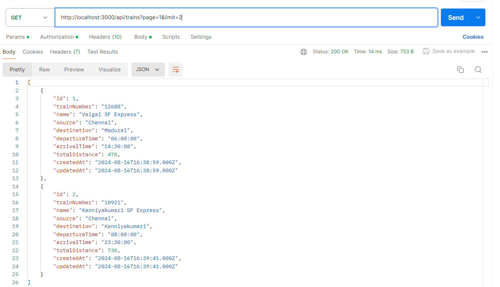
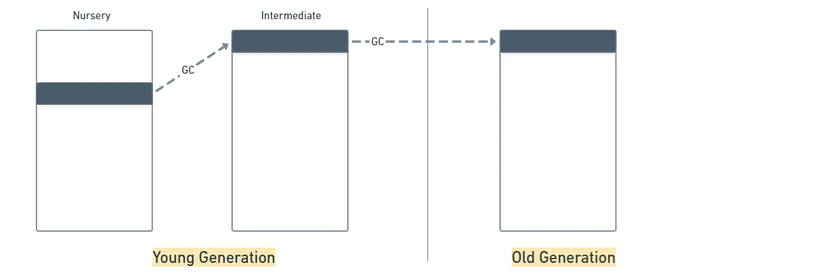
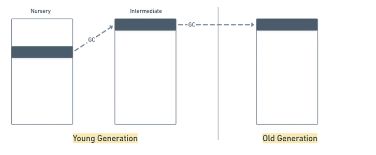
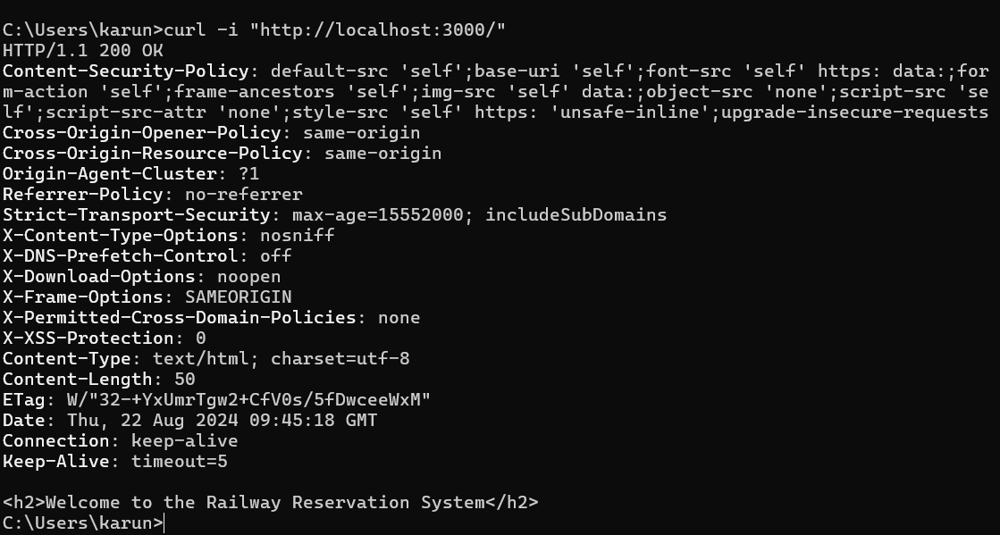
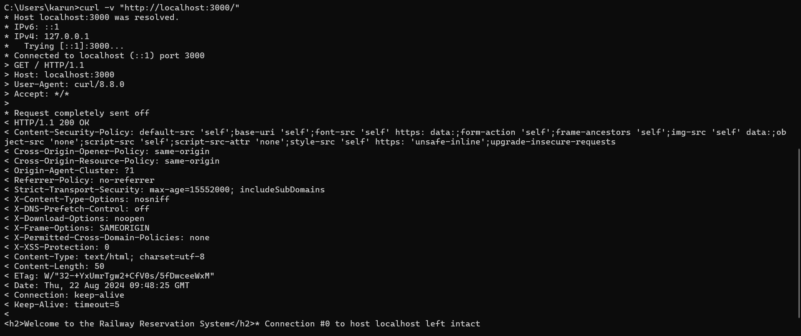

## Milestone -4

## Package.json:

- The package.json file is a crucial part of any Node.js project. 
- It contains metadata about the project and handles dependencies, scripts, and configuration.

The package.json file contains the metadata information. 
This metadata information in package.json file can be categorized into below categories.

`Identifying metadata properties`: 

It basically consist of the properties to identify the module/project such as the name of the project, current version of the module, license, author of the project, description about the project etc.

`Functional metadata properties`: 

It consists of the functional values/properties of the project/module such as the entry/starting point of the module, dependencies in project, scripts being used, repository links of Node project etc.

`Creating package.json file`:

    npm init

---

Example:

    {
        "name": "railway",
        "version": "1.0.0",
        "main": "src/app.js",
        "scripts": {
            "start": "node src/app.js",
            "lint": "eslint .",
            "test": "jest"
        },
        "keywords": [],
        "author": "",
        "license": "ISC",
        "description": "",
        "dependencies": {
            ...
        }

        "dev-dependencies: {
            ...
        }
    }

- name: The name of your project.
- version: The version of your project.
- description: A short description of the project.
- main: The entry point file (e.g., index.js).
- scripts: Commands that can be run using npm run.
- dependencies: List of packages required for production.
- devDependencies: List of packages only needed for development.
- author: The author of the project.
- license: License type.
- dependencies: List of packages required for production.
- devDependencies: List of packages only needed for development.

---

## Semantic Versioning:

In package.json, the version numbers for dependencies often include special characters like ^, ~, *, and others. 

These characters define how npm should handle updates to your dependencies. 

        major.minor.patch

## Versioning Symbols:

### 1. Caret (^):

Allows updates to minor and patch version only.

Example: "express": "^4.18.2" allows updates from 4.18.2 to any version below 5.0.0 (like 4.19.0, 4.20.0, etc.), but not to 5.0.0.

### 2.Tilde (~):

Allows updates to the patch version (the last number).

Example: "express": "~4.18.2" allows updates from 4.18.2 to any version below 4.19.0 (like 4.18.3, 4.18.4, etc.), but not to 4.19.0.

### 3. Exact Version (No Symbol):

Locks the version to the exact number specified.

Example: "express": "4.18.2" will only install version 4.18.2 and no other updates.

### 4. Asterisk (*):

Matches any version.

Example: "express": "*" will allow installing any version of express.

### 5. Greater than / Less than (>, <, >=, <=):

Specifies version ranges.

Example: "express": ">=4.18.2 <5.0.0" will install any version from 4.18.2 to just below 5.0.0.

---

## Package-lock.json:

 - It is a detailed record of the exact versions of every installed dependency and sub-dependency in your project. 
 
 - It ensures that the same dependency versions are used when the project is installed in different environments, keeping your application consistent.

## Purpose of package-lock.json:

- Ensures consistent installations across environments.
- Prevents unexpected bugs due to different versions of dependencies being installed.

---

## Dependencies and Dev dependencies:

The `dependencies` and `devDependencies` properties in the `package.json` file are used to manage different types of dependencies in a Node.js project.

## Dependencies:

 The `dependencies` property is used to list the packages that are required for the project to run in a production or deployment environment.

— These packages are necessary for the application’s core functionality and are typically required at runtime.

Example:

 "dependencies": {
        "@sendgrid/mail": "^8.1.3",
        "axios": "^1.7.4",
        "bcrypt": "^5.1.1",
        "bcryptjs": "^2.4.3",
        "body-parser": "^1.20.2",
        "dotenv": "^16.4.5",
        "emailjs": "^4.0.3",
        "emailjs-com": "^3.2.0"
    }

## Dev dependencies:

- It consists of all the packages that are used in the project in its development phase and not in the production or testing environment with its version number. 

- So, whenever you want to install any library that is required only in your development phase then you can find it in the dev Dependencies object.

        "devDependencies": {
            "@eslint/js": "^9.9.0",
            "eslint": "^9.9.0",
            "jest": "^29.7.0",
            "prettier": "^3.3.3"
        }

---
## Node Js - Security

## OWASP Top-10 Security Risks:

The OWASP Top 10 is a standard awareness document for developers and web application security. 

`A01:2021 - Broken Access Control`

Access control restrictions are not properly enforced, allowing unauthorized actions. 

`A02:2021 - Cryptographic Failures`

Issues arise from improper use of cryptography, leading to data exposure or system compromise. 

`A03:2021 - Injection`

Improper handling of untrusted data leads to commands or queries being executed (e.g., SQL Injection, Cross-site Scripting).

`A04:2021 - Insecure Design`

Security issues arise from flaws in the design, highlighting the need for secure design principles, threat modeling, and secure architecture.

`A05:2021 - Security Misconfiguration`

Improper configurations in the application or infrastructure, such as default settings or overly verbose error messages, lead to vulnerabilities.

`A06:2021 - Vulnerable and Outdated Components`

Using outdated or vulnerable third-party libraries, frameworks, or components without proper updates or risk assessments.

`A07:2021 - Identification and Authentication Failures`

Weak or mismanaged authentication and session controls, allowing attackers to impersonate users or bypass authentication mechanisms.

`A08:2021 - Software and Data Integrity Failures`

Failures to ensure the integrity of software and data, particularly in CI/CD pipelines or software updates, can lead to exploits like malicious code injections.

`A09:2021 - Security Logging and Monitoring Failures`

Inadequate logging, monitoring, or alerting, making it difficult to detect or respond to breaches or incidents.

`A10:2021 - Server-Side Request Forgery (SSRF)`
The application allows attackers to make unauthorized requests to internal or external systems, leading to data exposure or system compromise.

---

## X -Powered-By header

The X-Powered-By header is often included in the response headers by web frameworks like Express to indicate which technology is powering the application (e.g., X-Powered-By: Express). 

While it can be useful for developers, it’s generally recommended to hide or remove this header in production environments for security reasons. 

Exposing this information could give attackers clues about the underlying technology stack, which they could potentially exploit.

## Why Should You Hide the X-Powered-By Header?

`Security by Obscurity:` 

Hiding this header reduces the exposure of your application’s internals to potential attackers.

`Prevent Targeted Attacks:` 

If attackers know that your app is running Express, they might try known vulnerabilities or attacks specific to that framework.

## Removing ways:

    app.disable('x-powered-by');

Using helmet, will remove this by default.

    app.use(helmet());

---

### PostMan Collections Naming:

- Postman is a popular API development and testing tool that simplifies the process of building, testing, and documenting APIs. 

- It provides a user-friendly interface for making HTTP requests and interacting with APIs.

## Workspace

- A workspace in Postman is a collaborative environment that contains all the resources and tools needed for API development. 

- Workspaces help organize your work and collaborate with team members.

## Collection
A collection in Postman is a group of related API requests organized into folders. Collections help manage and structure API requests, making it easier to test and document APIs. 

### Key features of collections include:

`Grouping Requests:`

 Organize requests by functionality or endpoints. For example, a collection for user management might include folders for authentication, profile management, and password management.

`Sharing and Collaboration:`

 Share collections with team members for collaboration and review.

`Documentation:` Add descriptions, examples, and tests to requests within a collection, making it easier to understand and use the API.

## Naming conventions:

- clearly describes the purpose or the functionality of the APIs contained in the collection.

- Follow a consistent naming convention across all your collections. This can be based on the project, functionality, or team conventions.

- Include Versioning: If applicable, include the version of the API or service in the collection name.

### Collections for Railway Reservation:

---
### Environment variables:

- In Postman, environment variables are used to manage different configurations and settings for your API requests. 

- They allow you to store and reuse values like API keys, URLs, or user credentials, making your requests more flexible and easier to manage.

How to Use Environment Variables in Postman

- Environments -> Click on Manage Environments. -> Click Add to create a new environment.

- Give your environment a name (e.g., "Development", "Staging", "Production").

- Add key-value pairs for the variables you need. 

For example:
        
        BASE_URL: https://api.example.com

        API_KEY: your-api-key-here

Click Save.

### Select the Environment

Select the environment you created from the dropdown menu.
This will apply the environment variables to your requests.
Use Environment Variables in Requests

You can use environment variables in your request URLs, headers, body, and tests by enclosing the variable names in double curly braces {{variableName}}.

### Examples:

    URL: {{BASE_URL}}/users
    Header: Authorization: Bearer {{API_KEY}}
    Body: { "username": "{{USERNAME}}", "password": "{{PASSWORD}}" }

### Set Environment Variables Dynamically

You can also set or update environment variables dynamically in your scripts (Pre-request Script or Tests).

---

### VSC debugging Mode:

- VS Code's built-in debugger helps accelerate your edit, compile, and debug loop.

`Debug View`:

        Ctrl + shift + D

`Launch.json config file`:

        {
            "version": "0.2.0",
            "configurations": [
                {
                    "type": "node",
                    "request": "launch",
                    "name": "Launch Program",
                    "skipFiles": [
                        "<node_internals>/**"
                    ],
                    "program": "${file}"
                }
            ]
        }

---

### Set a Breakpoint:

- A breakpoint is a fundamental debugging tool used in software development to pause the execution of a program at a specific line of code. 

- This allows you to inspect the program's state, such as variable values and the call stack, to understand and diagnose issues more effectively.

- Open app.js in VS Code.
- Click in the gutter next to the console.log line to set a breakpoint.

### Start Debugging:

- Go to the Debug panel, select the Launch Program configuration, and click the green play button.

### Debugging:

- The execution will pause at the breakpoint.
- Use the debug toolbar to step through the code, inspect variables, and view the call stack.

---

### SQL Injection:

- SQL injection is a common and dangerous security vulnerability in web applications. - It occurs when an attacker is able to execute arbitrary SQL code on a database by manipulating input fields or query parameters. 
- This can lead to unauthorized access, data breaches, and other serious consequences.

### How SQL Injection Works?

- SQL injection exploits vulnerabilities in a web application’s SQL queries. 
- When user inputs are not properly sanitized, an attacker can inject malicious SQL code into the query, which the database then executes.

---

## Injecting query

#### Using comment (--):

        SELECT * FROM users WHERE username = 'admin' --' AND password = 'password';

#### Using OR 1 = 1

        SELECT * FROM users WHERE username = 'admin' OR 1=1;

- To prevent SQL Injection, you can use parameterized queries or prepared statements to sanitize user input before executing SQL queries.

#### Query with parameterized inputs
        
        const query = 'SELECT * FROM users WHERE username = ? AND password = ?';

---

### Indexing:

 - An index is a database object that provides a fast way to look up rows in a table based on the values in one or more columns. 
 
 - It acts like a reference or pointer to the actual data stored in the database.

### SQL - Indexing

- MySQL indexing is a technique used to improve the speed of database queries by creating indexes on one or more columns of a table. 

- Indexes help the database engine locate data more efficiently.

`Primary Key Index`:

Automatically created when a primary key is defined.

        CREATE TABLE employees (
        id INT PRIMARY KEY,
        name VARCHAR(100),
        position VARCHAR(100)
        );

`Unique Key Index`:

Ensures that all values in the indexed column(s) are unique.

        CREATE TABLE users (
        id INT PRIMARY KEY,
        email VARCHAR(255) UNIQUE
        );

`Index (Non-Unique Index)`:

Improves the performance of queries that involve columns used in WHERE clauses, joins, or sorting, but does not enforce uniqueness.

    CREATE INDEX idx_name ON employees (name);

`Full-Text Index`:

Used for full-text searches within text columns. It allows for searching within textual data using natural language processing techniques.

    CREATE TABLE articles (
    id INT PRIMARY KEY,
    title VARCHAR(255),
    content TEXT,
    FULLTEXT (title, content)
    );

`Descending Index`:

It is simple index used to store data in a reverse order. Using this index, it is easy to search for the latest values inserted into the database table.

---

## Creating an Index:

    CREATE INDEX idx_column_name ON table_name (column_name);

## Dropping an Index:

    DROP INDEX idx_name ON employees;

## Example

    {
    indexes: [
        {
        unique: true,
        fields: ['seatId', 'trainNumber', 'coachNumber'],
        },
    ],
    }

This index ensures that the combination of seatId, trainNumber, and coachNumber is unique, meaning that a particular seat in a specific coach and train can be booked only once.

---

## Clustered Index:

- A clustered index determines the physical order of data in a table.
- There can be only one clustered index per table because the data rows themselves are stored in this order.
- The clustered index is typically created on the primary key of the table.
- In a clustered index, the leaf nodes of the index contain the actual data rows.

        CREATE TABLE employees (
            id INT PRIMARY KEY, -- This creates a clustered index on 'id'
            name VARCHAR(100),
            department VARCHAR(100)
        );

## Non - Clustered Index:

- A non-clustered index does not affect the physical order of the data in the table.
- There can be multiple non-clustered indexes on a table.
- A non-clustered index creates a separate structure from the table where it stores pointers to the actual data.

        CREATE INDEX idx_name ON employees (name);

---

## SQL Triggers:

A trigger in MySQL is a set of SQL statements that reside in a system catalog. It is a special type of stored procedure that is invoked automatically in response to an event. Each trigger is associated with a table, which is activated on any DML statement such as INSERT, UPDATE, or DELETE.

---
## Creating a Trigger:

        CREATE TRIGGER trigger_name  trigger_time trigger_event  
        ON table_name FOR EACH ROW  
        BEGIN  
            --variable declarations  
            --trigger code  
        END;    

## Row level Trigger:

- Row-level triggers are executed for each row affected by an INSERT, UPDATE, or DELETE operation. 
- They allow you to perform actions that are specific to each row that meets the criteria of the trigger.

        CREATE TRIGGER check_discount
        BEFORE INSERT ON sales
        FOR EACH ROW
        BEGIN
            IF NEW.discount < 0 OR NEW.discount > 50 THEN
                SIGNAL SQLSTATE '45000'
                SET MESSAGE_TEXT = 'Discount must be between 0 and 50';
            END IF;
        END;

## Statement level trigger:

Statement-level triggers are executed once per triggering event, regardless of the number of rows affected. They are useful for actions that need to be performed once for the entire statement rather than for each row.

        CREATE TRIGGER log_employee_updates
        AFTER UPDATE ON employees
        FOR EACH STATEMENT
        BEGIN
            INSERT INTO logs (event_description)
            VALUES ('Employees table updated');
        END;

---

### All Triggers

`BEFORE INSERT` - Triggered before inserting a new row into the table.

`AFTER INSERT` - Triggered after inserting a new row into the table.

`BEFORE UPDATE` - Triggered before updating an existing row in the table.

`AFTER UPDATE` - Triggered after updating an existing row in the table.

`BEFORE DELETE` - Triggered before deleting an existing row from the table.

`AFTER DELETE` - Triggered after deleting an existing row from the table.

---

## Example:

        CREATE TRIGGER prevent_negative_price
        BEFORE INSERT ON products
        FOR EACH ROW
        BEGIN
            IF NEW.price < 0 THEN
                SIGNAL SQLSTATE '45000'
                SET MESSAGE_TEXT = 'Price cannot be negative';
            END IF;
        END;

---

## MongoDB

- MongoDB is a NoSQL database that stores data in flexible, JSON-like documents.

- It stores data BSON format, which is a binary representation of JSON documents.

## Indexing in MongoDB

 - An index is a database object that provides a fast way to look up rows in a table based on the values in one or more columns. 
 
 - It acts like a reference or pointer to the actual data stored in the database.

The createIndex() method also has a number of optional parameters. These include:  

- background (Boolean) 
- unique (Boolean) 
- name (string) 
- sparse (Boolean) 
- expireAfterSeconds (integer)
- hidden (Boolean) 
- storageEngine (Document)
- Drop an index 

To create an index in MongoDB, you can use the createIndex method on the collection object.

`Single field`:

        db.collection.createIndex({ field: 1 });

`Compound fields`:

        db.collection.createIndex({ field1: 1, field2: -1 });

`Unique index`:

        db.collection.createIndex({ fieldName: 1 }, { unique: true });

`Text index`:

        db.collection.createIndex({ fieldName: "text" });

## Index Types and Options

- Ascending (1) and Descending (-1): Specifies the sort order.
- Unique: Ensures all values in the indexed field are unique.
- TTL (Time-to-Live): Automatically removes documents after a specified period.

`View All Indices`:

        db.collection.getIndexes();

`Drop Index`:

        db.collection.dropIndex("indexName"); 

        db.collection.dropIndex({ fieldName: 1 });

---

### Mongoose:

- Mongoose is an Object Data Modeling (ODM) library for MongoDB and Node.js. 

- It provides a straightforward way to interact with MongoDB databases using a schema-based approach, allowing you to model your data with defined schemas and interact with it using JavaScript objects.

        const mongoose = require("mongoose");

        const userSchema = new mongoose.Schema({
        name: String,
        email: String,
        });

        userSchema.index({ name: 1 });

---

### Schema in mongoose ODM:

const mongoose = require('mongoose');

        const userSchema = new mongoose.Schema({
            username: {
                type: String,
                required: true,         
                unique: true,          
            },
            email: {
                type: String,
                required: true,         
                unique: true,          
            },
            password: {
                type: String,
                required: true,        
            },
            role: {
                type: String,
                enum: ['user', 'admin'],
                default: 'user',        
            },
        });

        const User = mongoose.model('User', userSchema);

        module.exports = User;

---

## Triggers in MongoDB Atlas:

How to Create a Trigger in MongoDB Atlas:

- `Navigate to Triggers`: Go to the "Triggers" section under your cluster.
- `Create a Trigger:`
- `Choose the event type` (insert, update, delete).
- Select the database and collection to watch.
- Write your serverless function code.
- `Save the trigger` to create it.

        exports = function(changeEvent) {
        const { fullDocument, operationType } = changeEvent;
        
        if (operationType === 'insert' || operationType === 'update') {
            const age = fullDocument.age;
            
            if (age <= 0) {
            console.error('Invalid age:', age);
            
            return context.services.get('logService').log({
                message: `Document with invalid age ${age} attempted to be saved.`,
                level: 'error',
                documentId: fullDocument._id
            });
            }
        }

        console.log('Valid age:', fullDocument.age);
        };

In MongoDB Atlas, context.services is a feature used within trigger functions to interact with various external services. It 

---

## Hooks in mongoDB:

- In Mongoose (and similar ODM libraries), hooks (or middleware) allow you to execute custom logic at specific points in the lifecycle of a document. 

- They act as intermediary steps before or after certain operations, such as saving, updating, or deleting documents.

        const mongoose = require('mongoose');
        const Schema = mongoose.Schema;

        const userSchema = new Schema({
        name: String,
        email: String,
        password: String,
        age: {
            type: Number,
            required: true
        }
        });

        userSchema.pre('save', function(next) {
        if (this.age <= 0) {
            return next(new Error('Age must be greater than 0.'));
        }
        console.log('Before saving user:', this);
        next(); 
        });

        userSchema.post('save', function(doc) {
        console.log('User saved:', doc);
        });

        const User = mongoose.model('User', userSchema);

        module.exports = User;

---